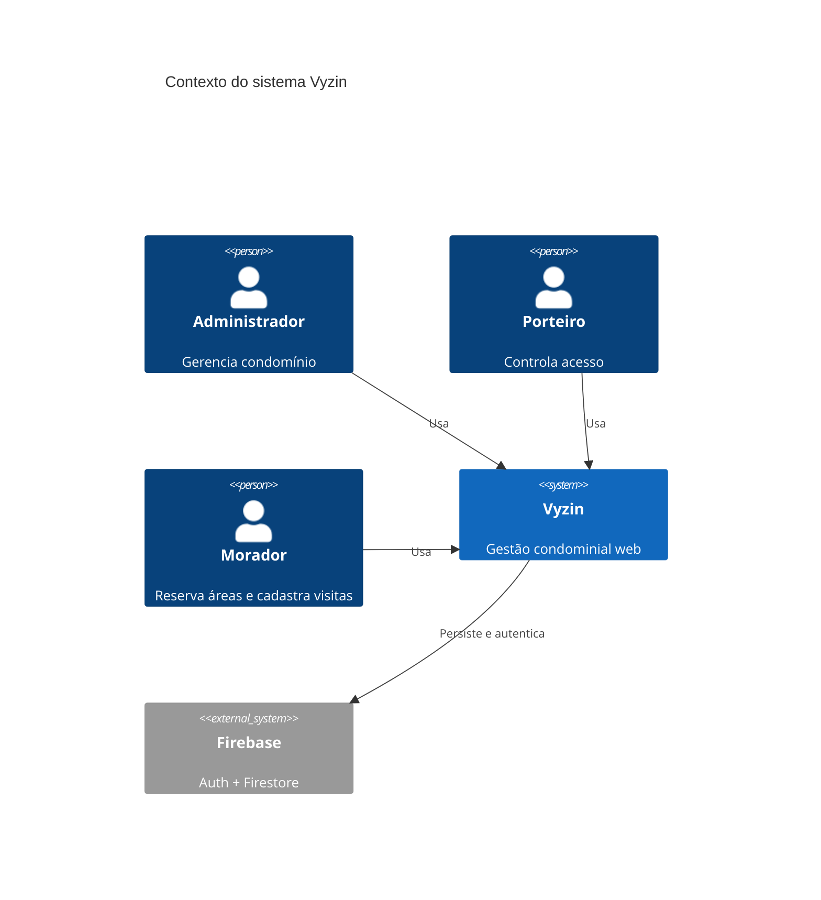
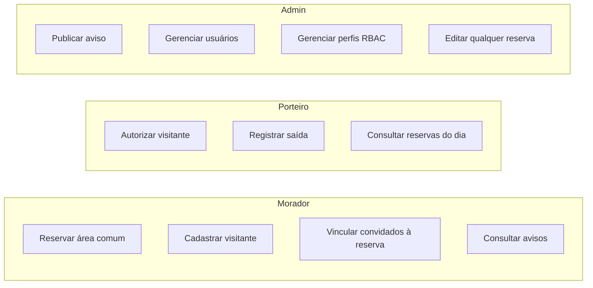
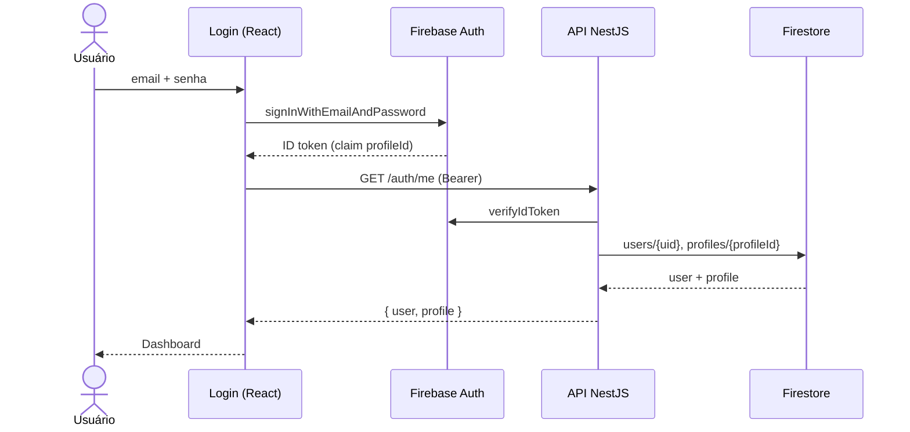
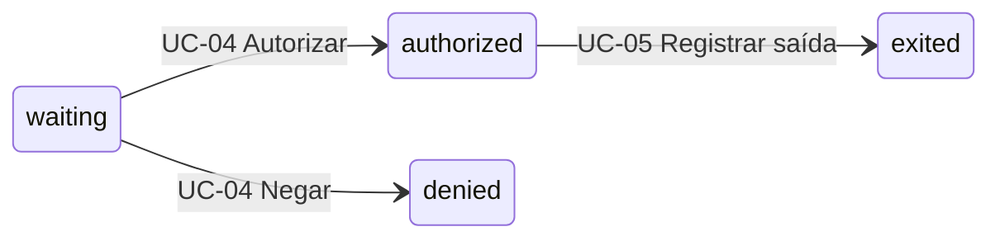
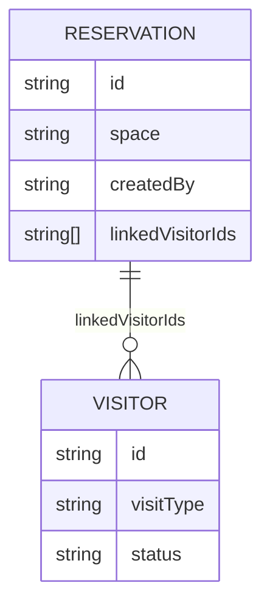
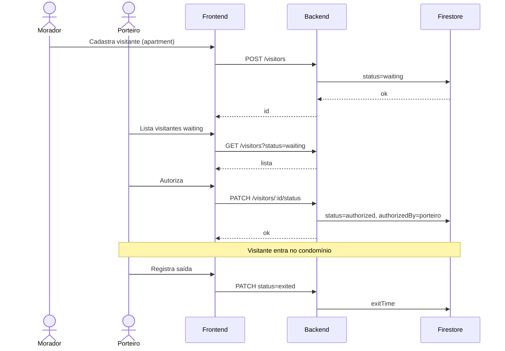
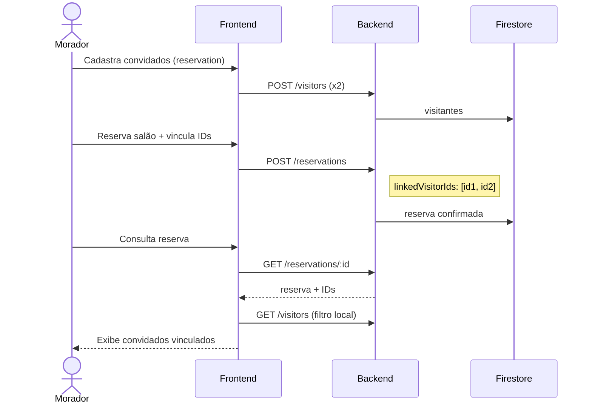
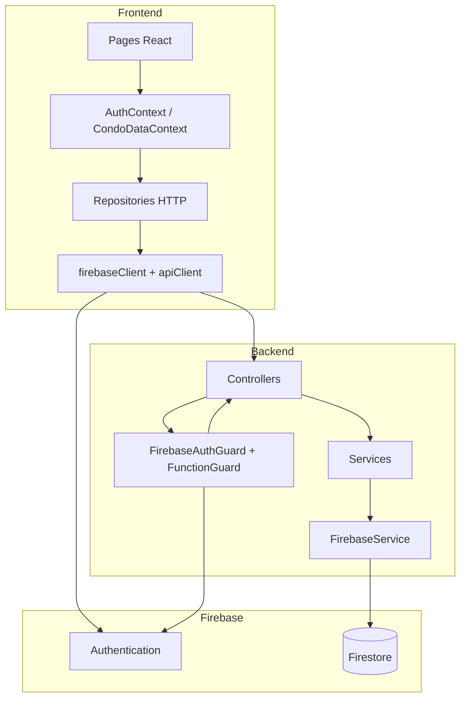
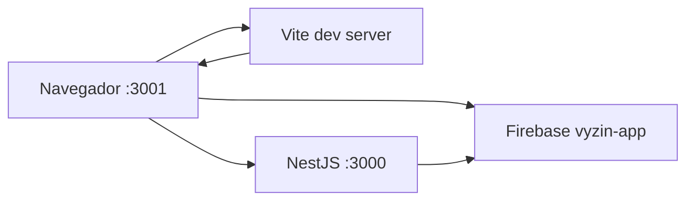

# Vyzin — Casos de Uso, Fluxos e Diagramas

**Versão:** MVP integrado  
**Última atualização:** junho/2026

Complementa [REGRAS_DE_NEGOCIO.md](./REGRAS_DE_NEGOCIO.md) com narrativas de usuário e diagramas. Para setup de testes manuais, ver [SETUP_TESTE.md](./SETUP_TESTE.md).

---

## 1. Atores

| Ator | Descrição | Perfil seed |
|------|-----------|-------------|
| **Administrador** | Síndico ou gestor do condomínio | `admin` |
| **Porteiro** | Operador da portaria | `doorman` |
| **Morador** | Condômino residente | `resident` |
| **Sistema** | Backend NestJS + Firebase | — |

---

## 2. Diagrama de contexto

---

## 3. Casos de uso — visão geral

---

## 4. Casos de uso detalhados

### UC-01 — Autenticar no sistema

| Campo | Valor |
|-------|-------|
| **Ator** | Qualquer usuário cadastrado |
| **Pré-condição** | Conta Firebase existente; e-mail/senha habilitados no console |
| **Fluxo principal** | 1. Usuário informa e-mail e senha → 2. Firebase valida → 3. Frontend obtém ID token → 4. Chama `GET /auth/me` → 5. Exibe dashboard conforme permissões |
| **Pós-condição** | Sessão ativa; menu filtrado por perfil |
| **Fluxos alternativos** | Credenciais inválidas → mensagem de erro; Firebase não configurado → `CONFIGURATION_NOT_FOUND` |

---

### UC-02 — Morador reserva área comum

| Campo | Valor |
|-------|-------|
| **Ator** | Morador |
| **Pré-condição** | Logado; possui `reservations:manage` |
| **Fluxo principal** | 1. Acessa Reservas → 2. Preenche espaço, data, horário → 3. Confirma → 4. API cria com `createdBy = uid` → 5. Reserva aparece na lista |
| **Regras** | RN-RES-02, RN-RES-03 |
| **Exceção** | Sem função → 403 na API; página oculta na UI |

**Dado demo:** morador@vyzin.com cria nova reserva; seed já inclui churrasqueira e salão de festas.

---

### UC-03 — Morador cadastra visitante aguardando portaria

| Campo | Valor |
|-------|-------|
| **Ator** | Morador |
| **Pré-condição** | `visitors:manage` |
| **Fluxo principal** | 1. Acessa Visitantes → 2. Cadastra visitante tipo `apartment` → 3. Status inicial `waiting` → 4. Porteiro vê na fila |
| **Regras** | RN-VIS-03 |

**Dado demo:** `demo-visitor-waiting` — Ana Paula Santos, aguardando autorização.

---

### UC-04 — Porteiro autoriza visitante

| Campo | Valor |
|-------|-------|
| **Ator** | Porteiro |
| **Pré-condição** | `visitors:workflow`; visitante em `waiting` |
| **Fluxo principal** | 1. Localiza visitante → 2. Ação "Autorizar" → 3. `PATCH /visitors/:id/status` com `authorized` → 4. `authorizedBy` = uid do porteiro |
| **Fluxo alternativo** | Negar → status `denied` |
| **Regras** | RN-VIS-04 |

**Teste manual:** login porteiro@vyzin.com → autorizar Ana Paula (`demo-visitor-waiting`).

---

### UC-05 — Porteiro registra saída de visitante

| Campo | Valor |
|-------|-------|
| **Ator** | Porteiro |
| **Pré-condição** | Visitante `authorized`; `visitors:workflow` |
| **Fluxo principal** | 1. Seleciona visitante → 2. Registra saída → 3. Status `exited`, `exitTime` preenchido |
| **Regras** | RN-VIS-04 |

**Dado demo:** Carlos Oliveira (`demo-visitor-authorized`) — candidato a saída após autorização.

---

### UC-06 — Morador vincula convidados a reserva de festa

| Campo | Valor |
|-------|-------|
| **Ator** | Morador |
| **Pré-condição** | Reserva confirmada; visitantes tipo `reservation` cadastrados |
| **Fluxo principal** | 1. Cria/edita reserva do salão → 2. Seleciona convidados → 3. Salva `linkedVisitorIds[]` |
| **Regras** | RN-RES-07 |

**Dado demo:** `demo-reservation-party` vincula Fernanda Lima e Lucas Mendes.

---

### UC-07 — Morador cancela própria reserva

| Campo | Valor |
|-------|-------|
| **Ator** | Morador |
| **Pré-condição** | `reservations:manage`; `createdBy === uid` |
| **Fluxo principal** | 1. Edita reserva → 2. Altera status para `cancelled` ou exclui registro |
| **Fluxo alternativo** | Tentar editar reserva de outro morador → 403 |
| **Regras** | RN-RES-03, RN-RES-08 |

**Dado demo:** `demo-reservation-cancelled` — quadra esportiva cancelada por chuva.

---

### UC-08 — Administrador publica aviso fixado

| Campo | Valor |
|-------|-------|
| **Ator** | Administrador |
| **Pré-condição** | `announcements:manage` |
| **Fluxo principal** | 1. Acessa Mural → 2. Novo aviso → 3. Define categoria, `isPinned`, `isImportant` → 4. Publica |
| **Regras** | RN-MUR-02, RN-MUR-03 |

**Dado demo:** manutenção do elevador (`demo-announcement-maintenance`).

---

### UC-09 — Administrador gerencia usuários

| Campo | Valor |
|-------|-------|
| **Ator** | Administrador (ou porteiro com `users:manage`) |
| **Pré-condição** | `users:manage` |
| **Fluxo principal** | 1. Acessa Usuários → 2. Cria usuário com perfil → 3. Backend provisiona Firebase Auth + Firestore + claim |
| **Fluxo alternativo** | E-mail duplicado → 409 Conflict |
| **Regras** | RN-USER-01 a RN-USER-04 |

---

### UC-10 — Administrador configura perfil RBAC

| Campo | Valor |
|-------|-------|
| **Ator** | Administrador |
| **Pré-condição** | `profiles:manage` |
| **Fluxo principal** | 1. Acessa Perfis → 2. Cria/edita perfil → 3. Marca funções desejadas → 4. Usuários com esse perfil passam a ter novas permissões no próximo login |
| **Regras** | RN-RBAC-04, RN-RBAC-05, RN-RBAC-06 |
| **Nota MVP** | Componente `ProfileManagement` referenciado no Layout; migrar do protótipo `Vyzin 1.0/` se ausente no frontend ativo |

---

### UC-11 — Administrador edita reserva de qualquer morador

| Campo | Valor |
|-------|-------|
| **Ator** | Administrador |
| **Pré-condição** | `reservations:manage_all` |
| **Fluxo principal** | 1. Lista reservas → 2. Edita reserva onde `createdBy ≠ admin` → 3. API permite via `assertCanManage` |
| **Regras** | RN-RES-03 |

**Dado demo:** `demo-reservation-admin` — sala de reuniões reservada pelo síndico.

---

### UC-12 — Consultar avisos e informações

| Campo | Valor |
|-------|-------|
| **Ator** | Morador / Porteiro / Admin |
| **Pré-condição** | `announcements:read` e/ou `information:read` |
| **Fluxo principal** | 1. Acessa Mural ou Informações → 2. Visualiza conteúdo |
| **Regras** | RN-MUR-05, RN-INF-01 |

---

## 5. Fluxo end-to-end — visita ao apartamento

---

## 6. Fluxo end-to-end — festa no salão

---

## 7. Diagrama de componentes (simplificado)

---

## 8. Diagrama de deployment (desenvolvimento)

---

## 9. Roteiro de testes por persona

### Morador (morador@vyzin.com)

1. Login → dashboard com atalhos
2. Reservas → ver churrasqueira e salão demo
3. Criar nova reserva
4. Visitantes → cadastrar visitante `apartment`
5. Mural → ler avisos (sem botão criar)
6. Informações → visualizar regras
7. Tentar acessar Usuários → menu oculto / redirect

### Porteiro (porteiro@vyzin.com)

1. Visitantes → filtrar `waiting` → autorizar Ana Paula
2. Visitantes → registrar saída de Carlos (se autorizado)
3. Reservas → somente leitura
4. Usuários → listar / cadastrar (perfil seed permite)

### Administrador (admin@vyzin.com)

1. Mural → criar/editar/excluir aviso
2. Reservas → editar reserva do morador (`demo-reservation-party`)
3. Usuários → CRUD
4. Perfis → CRUD funções (quando tela disponível)

---

## 10. Referências

- [REGRAS_DE_NEGOCIO.md](./REGRAS_DE_NEGOCIO.md)
- [DOCUMENTACAO_TECNICA.md](./DOCUMENTACAO_TECNICA.md)
- [SETUP_TESTE.md](./SETUP_TESTE.md)
- [PRODUTO_E_PROJETO.md](./PRODUTO_E_PROJETO.md)
