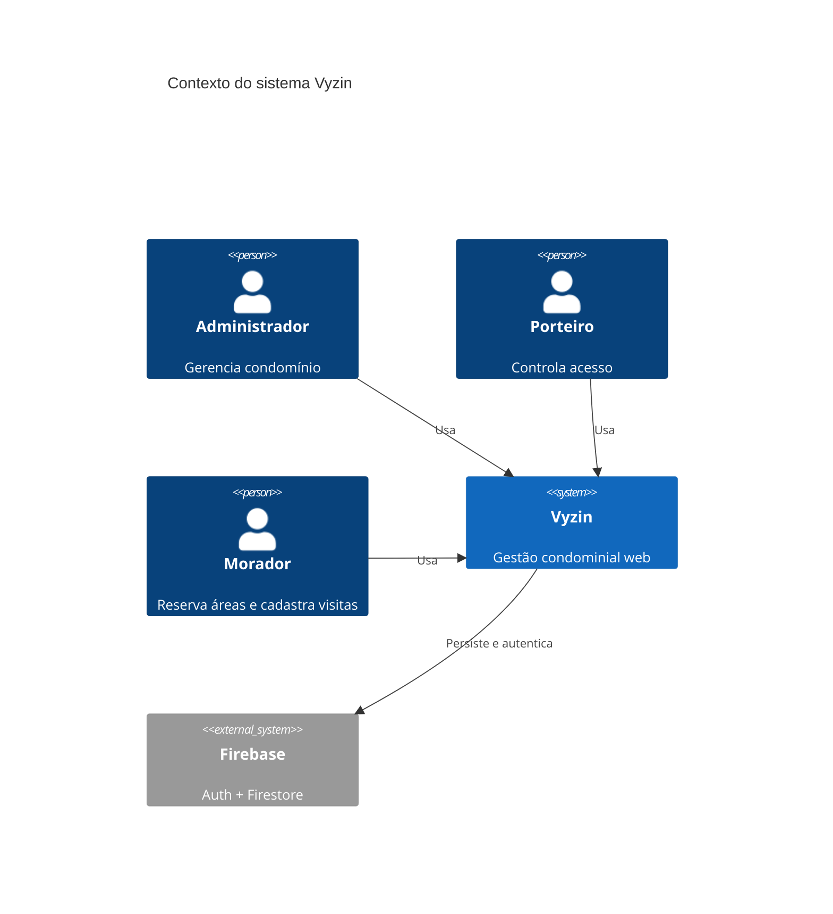
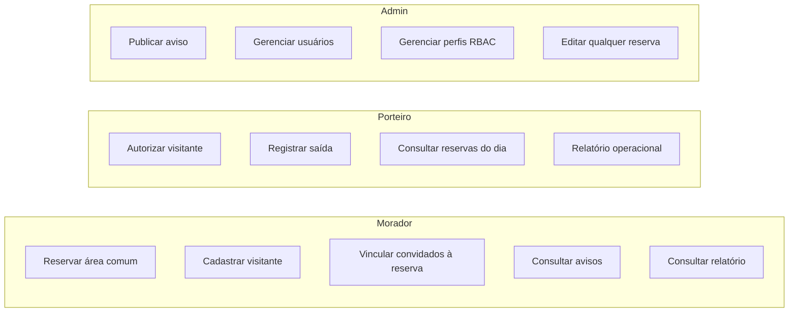
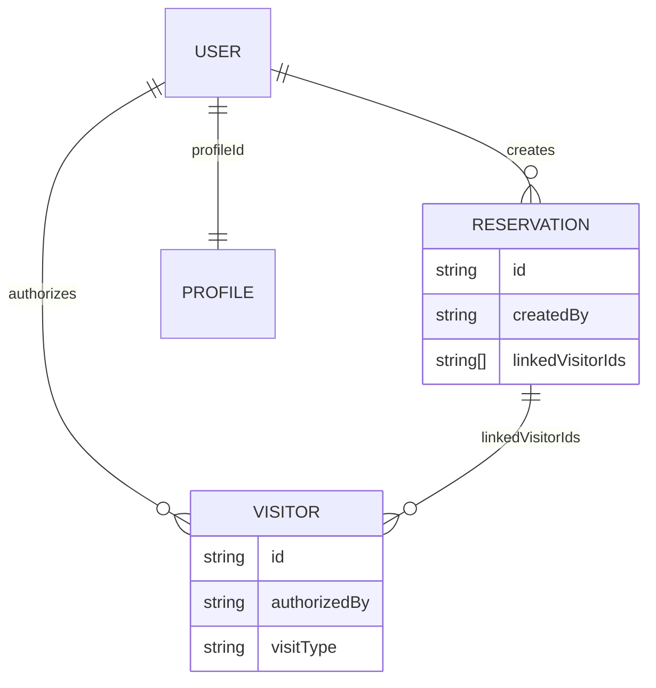
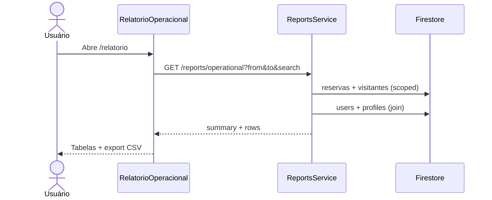
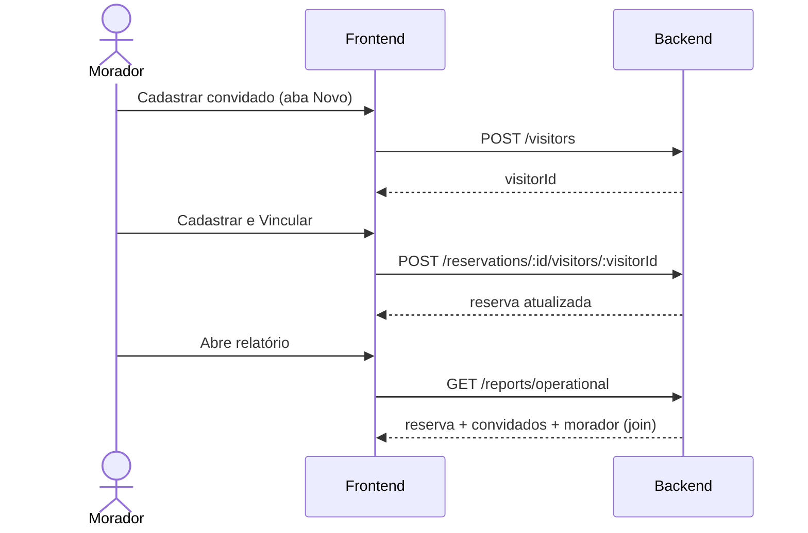
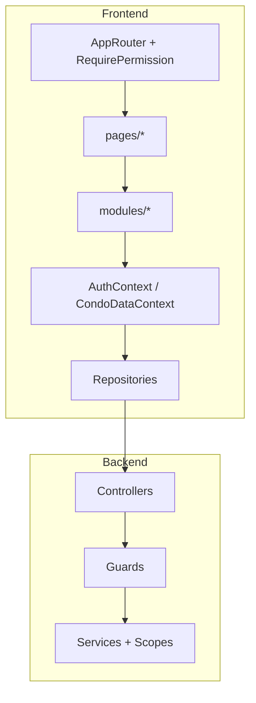

# Vyzin — Casos de Uso, Fluxos e Diagramas

**Versão:** MVP integrado  
**Última atualização:** junho/2026

Complementa [REGRAS_DE_NEGOCIO.md](./REGRAS_DE_NEGOCIO.md) com narrativas de usuário e diagramas. Para setup de testes manuais, ver [SETUP_TESTE.md](./SETUP_TESTE.md).

---

## 1. Atores

| Ator | Descrição | Perfil seed |
|------|-----------|-------------|
| **Administrador** | Síndico ou gestor do condomínio | `admin` |
| **Porteiro** | Operador da portaria | `doorman` |
| **Morador** | Condômino residente | `resident` |
| **Sistema** | Backend NestJS + Firebase | — |

---

## 2. Diagrama de contexto

---

## 3. Casos de uso — visão geral

---

## 4. Casos de uso detalhados

### UC-01 — Autenticar no sistema

| Campo | Valor |
|-------|-------|
| **Ator** | Qualquer usuário cadastrado |
| **Pré-condição** | Conta Firebase existente |
| **Fluxo principal** | 1. E-mail e senha → 2. Firebase valida → 3. `GET /auth/me` → 4. Dashboard com menu filtrado |
| **Pós-condição** | Sessão ativa; funções carregadas do perfil |

---

### UC-02 — Morador reserva área comum

| Campo | Valor |
|-------|-------|
| **Ator** | Morador |
| **Pré-condição** | `reservations:manage` |
| **Fluxo principal** | 1. Reservas → Nova → 2. Escolhe espaço e data → 3. Seleciona slot disponível → 4. Confirma → API valida conflito |
| **Regras** | RN-RES-02, RN-RES-06 |

---

### UC-03 — Morador cadastra visitante

| Campo | Valor |
|-------|-------|
| **Ator** | Morador |
| **Pré-condição** | `visitors:manage` |
| **Fluxo principal** | Cadastra visitante `apartment` ou `reservation`; status inicial `waiting` (ou `authorized` se cadastro via modal de reserva) |
| **Dado demo** | `demo-visitor-waiting` — Ana Paula Santos |

---

### UC-04 — Porteiro autoriza visitante

| Campo | Valor |
|-------|-------|
| **Ator** | Porteiro |
| **Pré-condição** | `visitors:workflow` |
| **Fluxo principal** | `PATCH /visitors/:id/status` → `authorized` |
| **Teste** | porteiro@vyzin.com → autorizar Ana Paula |

---

### UC-05 — Porteiro registra saída

| Campo | Valor |
|-------|-------|
| **Ator** | Porteiro |
| **Pré-condição** | Visitante `authorized` |
| **Fluxo principal** | Status `exited` + `exitTime` |

---

### UC-06 — Morador vincula convidados a reserva

| Campo | Valor |
|-------|-------|
| **Ator** | Morador (ou porteiro com permissão) |
| **Pré-condição** | Reserva confirmada; `visitors:manage` |
| **Fluxo principal** | 1. Abre reserva → Adicionar Visitante → 2a. Seleciona existente **ou** 2b. Cadastra novo → 3. `POST /reservations/:id/visitors/:visitorId` |
| **Regras** | RN-RES-07 |

**Dado demo:** `demo-reservation-party` + Fernanda Lima + Lucas Mendes.

---

### UC-07 — Morador cancela própria reserva

Altera status para `cancelled` ou exclui; ownership validado no scope.

---

### UC-08 — Administrador publica aviso

CRUD no Mural com `announcements:manage`.

---

### UC-09 — Administrador gerencia usuários

Tela **Segurança → Usuários**; provisiona Firebase Auth + Firestore.

---

### UC-10 — Administrador configura perfil RBAC

Tela **Segurança → Perfis** (`ProfileManagement.tsx`); marca funções incluindo `reports:read`.

---

### UC-11 — Administrador edita reserva de qualquer morador

Requer `reservations:manage_all`.

---

### UC-12 — Consultar avisos e informações

Rotas `/mural` e `/informacoes`.

---

### UC-13 — Consultar relatório operacional

| Campo | Valor |
|-------|-------|
| **Ator** | Admin, Porteiro ou Morador |
| **Pré-condição** | `reports:read` |
| **Fluxo principal** | 1. Painel → Relatório Operacional **ou** menu Relatório → 2. Ajusta filtros (período, status, busca) → 3. Consulta abas Reservas/Visitantes → 4. Opcional: export CSV |
| **Regras** | RN-REP-01 a RN-REP-05 |

---

## 5. Fluxo end-to-end — festa no salão

---

## 6. Diagrama de componentes (frontend)

---

## 7. Roteiro de testes por persona

### Morador (morador@vyzin.com)

1. Login → dashboard (logout/login se menu Relatório não aparecer)
2. Reservas → criar reserva com slot disponível
3. Reserva churrasqueira → Adicionar Visitante → Cadastrar e Vincular
4. Relatório → filtrar últimos 30 dias → ver joins
5. Mural → leitura; Informações → regras

### Porteiro (porteiro@vyzin.com)

1. Visitantes → autorizar Ana Paula (`waiting`)
2. Reservas → leitura de todas as reservas
3. Relatório → visão ampliada
4. Usuários → listar/cadastrar

### Administrador (admin@vyzin.com)

1. Mural → CRUD aviso
2. Reservas → editar reserva do morador
3. Segurança → Usuários e Perfis
4. Relatório → export CSV

---

## 8. Referências

- [REGRAS_DE_NEGOCIO.md](./REGRAS_DE_NEGOCIO.md)
- [DOCUMENTACAO_TECNICA.md](./DOCUMENTACAO_TECNICA.md)
- [SETUP_TESTE.md](./SETUP_TESTE.md)
- [PRODUTO_E_PROJETO.md](./PRODUTO_E_PROJETO.md)
