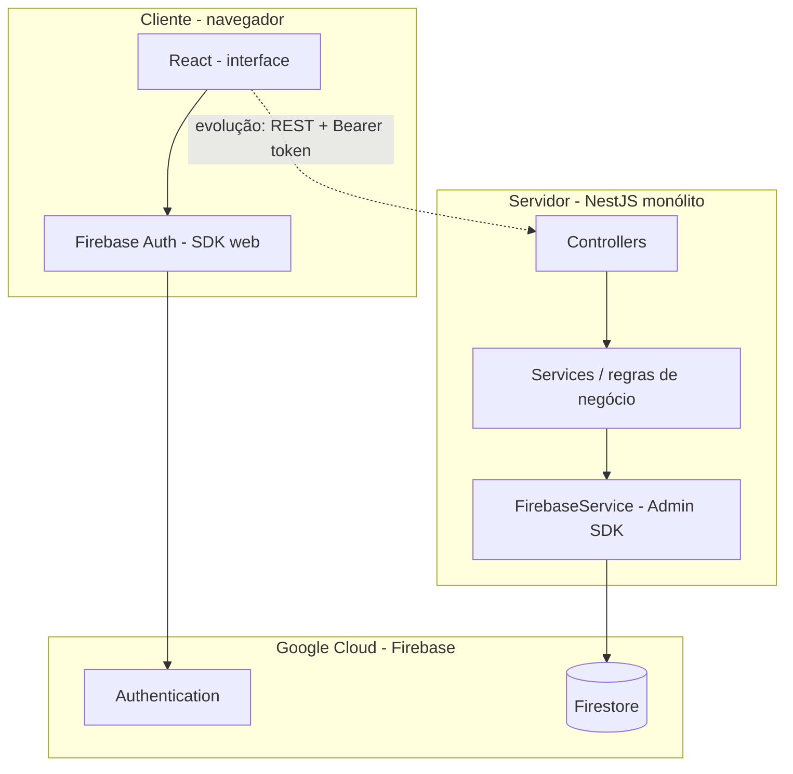

# Documentação técnica do sistema Vyzin

**Projeto:** Vyzin — sistema de gestão de condomínios (MVP)  
**Organização do repositório:** monorepo (`frontend/` e `backend/`)  
**Versão do documento:** alinhada ao estado atual do código-fonte no repositório.

---

## 1. Resumo

O Vyzin é uma aplicação web cujo objetivo é apoiar a gestão de condomínios, com escopo inicial (MVP) centrado em autenticação de usuários, reservas de áreas comuns e mural de avisos ou chamados. A solução adota arquitetura em camadas: interface em **React** (Create React App), API monolítica em **NestJS** (Node.js) e persistência na nuvem com **Google Firebase** (Firestore e Authentication). O backend utiliza o **Firebase Admin SDK** para acesso privilegiado ao Firestore, enquanto o frontend utiliza o **Firebase JS SDK** para autenticação diretamente contra o Firebase Authentication, padrão comum quando se deseja sessão gerida pelo próprio Firebase no cliente.

Este documento descreve a arquitetura de software, o mapeamento para o paradigma **MVC** solicitado em contexto acadêmico, e a organização explícita do código no backend e no frontend.

---

## 2. Introdução e objetivos

### 2.1 Contexto

Em disciplinas de **Arquitetura de Software** e **Programação Web**, é frequente exigir-se uma aplicação com separação de responsabilidades entre apresentação, lógica de negócio e dados. O Vyzin foi estruturado para:

- expor uma **API HTTP** (REST) no backend;
- manter regras de negócio e acesso a dados concentrados no servidor;
- apresentar interface rica no navegador, sem acoplamento direto da interface ao modelo de dados além do contrato da API (evolução futura) e do uso controlado do Firebase Auth no cliente.

### 2.2 Objetivos técnicos do MVP

| Objetivo | Realização no código atual |
|----------|----------------------------|
| Monólito | Um único processo NestJS compõe a API. |
| MVC (mapeamento) | Controllers e Services no Nest; persistência via serviços/repositórios (Firestore); frontend como camada de apresentação. |
| Banco na nuvem | Firestore via `firebase-admin` no backend. |
| Autenticação | E-mail e senha no frontend com Firebase Auth; validação de token no backend é etapa natural de evolução. |

---

## 3. Visão arquitetural global

### 3.1 Monorepo

O repositório agrupa dois pacotes Node.js independentes:

- **`frontend/`** — aplicação React (SPA) servida em desenvolvimento pelo webpack dev server (porta configurável, por exemplo 3001).
- **`backend/`** — aplicação NestJS que escuta HTTP (porta padrão 3000, configurável por `PORT`).

Essa organização facilita versionamento único, revisão em pull requests e alinhamento de contratos entre cliente e servidor.

### 3.2 Diagrama de contexto (camadas)



**Leitura do diagrama:** hoje, o login ocorre entre o React e o **Firebase Authentication** (seta direta). O backend já está preparado para **Firestore** via Admin SDK. A integração completa “painel autenticado chama API Nest” será implementada quando os controllers enviarem o **ID Token** do Firebase no cabeçalho `Authorization` e o Nest validar com `admin.auth().verifyIdToken()`.

---

## 4. Mapeamento MVC (disciplina) para NestJS e React

Em um MVC “clássico” (por exemplo, servidor que renderiza views), **Model** representa dados e persistência, **View** a apresentação e **Controller** orquestra requisições.

No Vyzin:

| Papel MVC | Onde vive no Vyzin |
|-----------|-------------------|
| **View** | Componentes React (`frontend/src/`), folhas de estilo (`App.css`, `index.css`), assets em `public/`. |
| **Controller** | Classes anotadas com `@Controller()` no NestJS; expõem rotas HTTP e delegam a serviços. Exemplo: `AppController` em `backend/src/app.controller.ts`. |
| **Model** | Em sentido acadêmico amplo: entidades e persistência. No Nest, costuma-se materializar como **Services** que orquestram regras e, em evolução, **repositórios** ou acesso explícito ao Firestore através do `FirebaseService`. |

O NestJS organiza o código em **módulos** (`@Module`), cada um podendo declarar `controllers` e `providers` (serviços injetáveis). Isso não substitui o MVC conceitual, mas **modulariza** o monólito por domínio (autenticação autorizada no servidor, reservas, mural).

---

## 5. Backend (NestJS) — arquitetura e código

### 5.1 Ponto de entrada e configuração

O ficheiro `backend/src/main.ts` cria a aplicação Nest e inicia o servidor HTTP:

```typescript
const app = await NestFactory.create(AppModule);
await app.listen(process.env.PORT ?? 3000);
```

A porta lê-se de `process.env.PORT`; o valor pode ser definido no ficheiro `.env` na raiz do backend, carregado pelo `ConfigModule` (ver abaixo).

### 5.2 Módulo raiz

O ficheiro `backend/src/app.module.ts` importa:

| Importação | Função |
|------------|--------|
| `ConfigModule.forRoot({ isGlobal: true })` | Carrega variáveis de ambiente (por exemplo `PORT`, credenciais Firebase em variáveis) para toda a aplicação. |
| `FirebaseModule` | Regista o `FirebaseService` como módulo **global**, disponível para injeção em qualquer outro serviço. |
| `AuthModule`, `ReservasModule`, `MuralModule` | Módulos de **domínio** do MVP; neste momento estão declarados como esqueleto (sem controllers próprios), servindo de fronteira clara para evolução. |
| `AppController`, `AppService` | Controlador e serviço de exemplo na raiz da aplicação. |

### 5.3 Exemplo explícito: Controller e Service

**`backend/src/app.controller.ts`** — papel de **Controller** no MVC:

- Decorador `@Controller()` define o prefixo de rota (vazio, logo a raiz `/`).
- O método `getHello()` responde a `GET /` e delega a `AppService`.

**`backend/src/app.service.ts`** — papel de **Service** (lógica de aplicação trivial neste exemplo):

- Método `getHello()` devolve a cadeia de caracteres `'Ola mundo'`.

Em trabalhos futuros, a lógica de negócio (validação de reservas, perfis de síndico e morador, etc.) concentrar-se-á em serviços dedicados dentro de `AuthModule`, `ReservasModule` e `MuralModule`, com controllers REST correspondentes.

### 5.4 Integração Firebase Admin — `FirebaseModule` e `FirebaseService`

**`backend/src/firebase/firebase.module.ts`**

- `@Global()` torna o módulo visível em toda a aplicação sem repetir `imports` em cada módulo de funcionalidade.
- Exporta `FirebaseService` para injeção (`providers` / `exports`).

**`backend/src/firebase/firebase.service.ts`**

- Implementa `OnModuleInit`: na inicialização do módulo, garante uma única inicialização do SDK (`if (!admin.apps.length)`).
- `resolveCredential()` escolhe a credencial na seguinte ordem:
  1. `GOOGLE_APPLICATION_CREDENTIALS` — caminho para ficheiro JSON da conta de serviço (adequado a CI e servidores).
  2. `FIREBASE_SERVICE_ACCOUNT_JSON` — JSON inline (uso pontual; requer cuidado com segredos).
  3. Ficheiro `firebase-key.json` no diretório de trabalho do backend (desenvolvimento local).
- `getFirestore()` expõe a instância `admin.firestore()` para leitura e escrita no Firestore **com privilégios de administrador** (as regras de segurança do Firestore aplicam-se ao SDK cliente, não ao Admin SDK da mesma forma).

**Nota de segurança académica:** o ficheiro de chave da conta de serviço **não deve** ser commitado no Git; o repositório deve listar `firebase-key.json` no `.gitignore` e documentar apenas o `.env.example`.

### 5.5 Módulos de domínio (estado atual)

| Módulo | Ficheiro | Comentário no código |
|--------|----------|----------------------|
| Autenticação / perfis | `backend/src/auth/auth.module.ts` | Reservado a regras de síndico e morador e, no servidor, verificação de token. |
| Reservas | `backend/src/reservas/reservas.module.ts` | Reserva de áreas comuns e regras temporais. |
| Mural | `backend/src/mural/mural.module.ts` | Avisos e reclamações com estados (ex.: aberto, resolvido). |

Estes módulos constituem a **decomposição modular** do monólito, alinhada ao MVP descrito na documentação de produto.

### 5.6 Testes automatizados

- Testes unitários Jest: `backend/src/app.controller.spec.ts`.
- Testes e2e: `backend/test/app.e2e-spec.ts` (sobe `AppModule`, portanto inicializa Firebase se as credenciais estiverem disponíveis).

---

## 6. Frontend (React) — arquitetura e código

### 6.1 Ferramenta de construção

O frontend utiliza **Create React App** (`react-scripts`), que abstrai Webpack e Babel. O código de entrada é `frontend/src/index.js`, que monta o componente raiz `App` no DOM.

### 6.2 Configuração do cliente Firebase

**`frontend/src/firebase/client.js`**

- Importa `initializeApp` e `getAuth`.
- Lê a configuração web a partir de variáveis de ambiente com prefixo `REACT_APP_` (exigência do CRA para expor variáveis ao bundle do browser).
- Se faltar algum campo obrigatório (`apiKey`, `authDomain`, `projectId`, `appId`), não inicializa a aplicação Firebase e exporta `auth = null` e `firebaseReady = false`.

As variáveis são documentadas em `frontend/.env.example`; o ficheiro `frontend/.env` (local) define `PORT` e as chaves do projeto.

**Observação:** as chaves presentes na configuração web do Firebase são, por desenho da plataforma, **identificadores públicos** do projeto; a segurança depende de regras no Firestore/Storage, de validação de tokens no backend e de políticas no Firebase Console.

### 6.3 Componente principal `App`

**`frontend/src/App.js`**

- Utiliza **hooks** do React: `useState` para estado local (utilizador, formulário, erros, modo login/registo) e `useEffect` para subscrever `onAuthStateChanged`.
- **Fluxo de autenticação:**
  - Modo “Entrar”: `signInWithEmailAndPassword(auth, email, password)`.
  - Modo “Criar conta”: `createUserWithEmailAndPassword(...)`.
  - “Sair”: `signOut(auth)`.
- Enquanto `onAuthStateChanged` não conclui a primeira notificação, pode mostrar-se um estado de carregamento.
- Se `firebaseReady` for falso, apresenta instruções para configurar o `.env`.

Este componente concentra, no MVP, **apresentação e orquestração do fluxo de auth**; em evolução, pode extrair-se um `AuthForm` ou um contexto `AuthContext` para reutilização e testes mais finos.

### 6.4 Estilo e identidade visual

**`frontend/src/index.css`**

- Define **variáveis CSS** (`:root`) para paleta: azul principal `#2563EB`, verde de sucesso `#10B981`, fundo `#F8FAFC`, texto `#1E293B`, entre outras.
- O `body` aplica fundo e tipografia do sistema.

**`frontend/src/App.css`**

- Estilos do cabeçalho com logótipo (`public/logo-vyzin.png`), formulário de autenticação (abas, campos, botões) e painel de exemplo de estado (“Reserva confirmada”).

### 6.5 Testes

**`frontend/src/App.test.js`** — verifica, após estabilizar o estado assíncrono, a presença dos campos de e-mail e senha quando o Firebase está configurado nos testes (variáveis carregadas pelo CRA a partir do `.env` de desenvolvimento).

---

## 7. Fluxo de dados e evolução recomendada

### 7.1 Estado atual

1. O utilizador autentica-se no browser contra **Firebase Authentication**.
2. O backend pode persistir dados no **Firestore** usando `FirebaseService`, ainda sem endpoints de domínio expostos além do `GET /` de exemplo.

### 7.2 Evolução alinhada à arquitetura em camadas

1. Após login, o frontend obtém `user.getIdToken()` e envia pedidos `fetch` ou `axios` para `http://localhost:3000/...` com `Authorization: Bearer <token>`.
2. Um **guard** ou **middleware** no Nest (ou um serviço injetado nos controllers) chama `admin.auth().verifyIdToken(token)` e associa o `uid` ao utilizador.
3. Os **Services** de reservas e mural aplicam regras de negócio e leem/escrevem no Firestore com coleções bem definidas (por exemplo `reservas`, `avisos`, `chamados`).

---

## 8. Execução local (resumo operacional)

| Passo | Backend | Frontend |
|-------|---------|----------|
| Instalar dependências | `cd backend && npm install` | `cd frontend && npm install` |
| Credenciais | Copiar `backend/.env.example` para `.env`; colocar `firebase-key.json` ou variáveis de credencial conforme documentado. | Copiar `frontend/.env.example` para `.env` e preencher `REACT_APP_FIREBASE_*`; `PORT=3001` se desejado. |
| Arranque em desenvolvimento | `npm run start:dev` | `npm start` |
| Portas típicas | 3000 | 3001 |

---

## 9. Conclusão

O Vyzin implementa um **monorepo** com **frontend React** e **backend NestJS**, com **Firebase** como plataforma de autenticação (cliente) e persistência (servidor via Admin SDK). A correspondência com **MVC** é explícita: controllers e services no Nest; modelo de dados e persistência centralizados no servidor através do `FirebaseService`; view no React. Os módulos `Auth`, `Reservas` e `Mural` delimitam o MVP e servem de base para a expansão documental e de código exigida ao longo do semestre.

---

## 10. Referências bibliográficas e documentação oficial

- NestJS. *Documentation*. https://docs.nestjs.com  
- Meta Open Source. *React — Documentação*. https://react.dev  
- Google. *Firebase Documentation* (Authentication, Firestore, Admin SDK). https://firebase.google.com/docs  
- Sommerville, I. *Software Engineering* (conceitos de arquitetura em camadas e MVC).  

---

*Documento elaborado para apoio à disciplina de Arquitetura de Software / Programação Web. Pode ser anexado a relatórios ou adaptado (capa institucional, nomes dos autores, número do grupo) conforme normas da instituição.*
