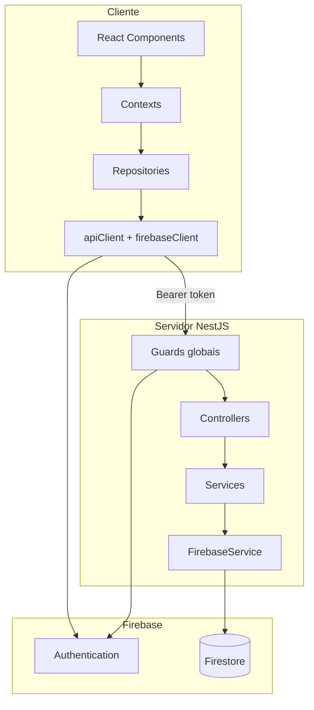
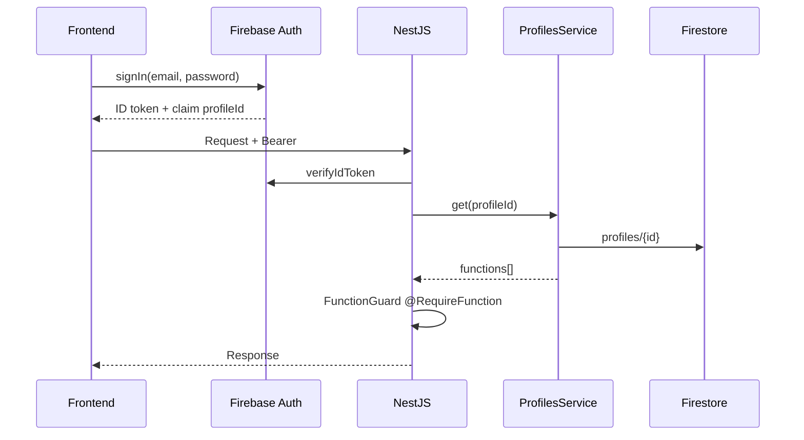

# Documentação técnica — Vyzin

**Projeto:** Vyzin — gestão condominial (MVP)  
**Organização:** monorepo (`frontend/` + `backend/`)  
**Versão:** integração frontend ↔ backend ↔ Firebase  
**Última atualização:** junho/2026

Documentos relacionados: [índice](./README.md) · [regras de negócio](./REGRAS_DE_NEGOCIO.md) · [casos de uso](./CASOS_DE_USO.md) · [setup](./SETUP_TESTE.md)

---

## 1. Resumo executivo

O Vyzin é uma SPA React que consome uma API REST NestJS. A autenticação usa **Firebase Auth** no cliente; o backend valida o **ID token** e aplica **RBAC dinâmico** via perfis e funções. Persistência no **Firestore** (Admin SDK).

| Camada | Stack | Porta dev |
|--------|-------|-----------|
| Frontend | React, TypeScript, Vite, Tailwind v4, shadcn/ui | 3001 |
| Backend | NestJS, TypeScript, class-validator | 3000 |
| Nuvem | Firebase Auth + Firestore (`vyzin-app`) | — |

---

## 2. Arquitetura global

### 2.1 Diagrama de camadas


```mermaid
flowchart TB
  subgraph client [Cliente]
    UI[React Components]
    CTX[Contexts]
    REPO[Repositories]
    API_CLIENT[apiClient + firebaseClient]
  end

  subgraph server [Servidor NestJS]
    GUARDS[Guards globais]
    CTRL[Controllers]
    SVC[Services]
    FB_SRV[FirebaseService]
  end

  subgraph firebase [Firebase]
    AUTH[Authentication]
    FS[(Firestore)]
  end

  UI --> CTX --> REPO --> API_CLIENT
  API_CLIENT -->|Bearer token| GUARDS --> CTRL --> SVC --> FB_SRV --> FS
  API_CLIENT --> AUTH
  GUARDS --> AUTH
```

### 2.2 Monorepo

```
vyzin/
├── backend/                 # API NestJS
│   ├── src/
│   │   ├── auth/            # Guards, decorators, catálogo de funções
│   │   ├── firebase/        # Admin SDK
│   │   ├── profiles/        # RBAC — perfis
│   │   ├── users/           # Usuários + Firebase Auth provisioning
│   │   ├── reservas/        # Reservas
│   │   ├── visitantes/      # Visitantes
│   │   ├── mural/           # Avisos
│   │   ├── scripts/seed.ts  # Bootstrap idempotente
│   │   ├── app.module.ts
│   │   └── main.ts
│   ├── requests.http        # Testes manuais de API
│   └── firebase-key.json    # Dev local (gitignored)
├── frontend/
│   └── src/app/
│       ├── components/      # Telas + shadcn/ui
│       ├── contexts/        # AuthContext, CondoDataContext
│       ├── data/            # Repositories HTTP
│       ├── domain/          # Tipos TypeScript
│       ├── infra/           # firebaseClient, apiClient
│       ├── services/        # AuthService (interface)
│       └── utils/           # permissions.ts
└── docs/                    # Documentação
```

### 2.3 Mapeamento MVC

| Papel MVC | Vyzin |
|-----------|-------|
| **View** | Componentes React (`frontend/src/app/components/`) |
| **Controller** | `@Controller()` NestJS — rotas HTTP, DTOs, decorators |
| **Model** | Entities + Firestore converters + Services com regras de negócio |

---

## 3. Backend (NestJS)

### 3.1 Bootstrap — `main.ts`

- CORS habilitado para `FRONTEND_ORIGIN` (padrão `http://localhost:3001`)
- `ValidationPipe` global (`whitelist`, `transform`)
- Porta: `process.env.PORT ?? 3000`

### 3.2 Módulo raiz — `app.module.ts`

Importa: `ConfigModule`, `FirebaseModule`, `AuthModule`, `ProfilesModule`, `UsersModule`, `ReservationsModule`, `VisitorsModule`, `MuralModule`.

### 3.3 Firebase — `FirebaseService`

Inicialização única do Admin SDK. Credenciais (ordem de prioridade):

1. `GOOGLE_APPLICATION_CREDENTIALS` — caminho para JSON
2. `FIREBASE_SERVICE_ACCOUNT_JSON` — JSON inline
3. `firebase-key.json` no diretório `backend/`

Métodos expostos:

- `getFirestore()` → `admin.firestore()`
- `getAuth()` → `admin.auth()` (verify token, create user, custom claims)

### 3.4 Padrão por domínio

Cada módulo segue a mesma estrutura:

```
dominio/
├── entities/          # Tipos de domínio + enums
├── dto/               # Entrada/saída HTTP (class-validator)
├── mappers/           # FirestoreDataConverter
├── services/          # Regras + acesso Firestore
├── controllers/       # Rotas + @RequireFunction
└── *.module.ts
```

### 3.5 Autenticação e RBAC

#### Guards globais (`AuthModule`)

Registrados como `APP_GUARD`:

1. **`FirebaseAuthGuard`** — extrai Bearer token, chama `verifyIdToken`, popula `request.user` com `uid`, `email`, `profileId` (claim). Rotas `@Public()` são ignoradas.

2. **`FunctionGuard`** — carrega perfil via `ProfilesService.get(profileId)` (cache em memória), preenche `user.functions[]`, valida `@RequireFunction(...)`.

#### Decorators

| Decorator | Uso |
|-----------|-----|
| `@Public()` | Rota sem token |
| `@RequireFunction(AppFunction.X)` | Exige função(ões) |
| `@CurrentUser()` | Injeta `AuthenticatedUser` no handler |

#### Catálogo de funções

Fonte única: `backend/src/auth/functions/app-functions.ts`

Exposta ao frontend: `GET /functions` (requer `profiles:read`).

### 3.6 Modelo de dados (Firestore)

| Coleção | Documento | Relacionamentos |
|---------|-----------|-----------------|
| `profiles` | `id`, `name`, `description`, `functions[]`, `isSystem` | Referenciado por `users.profileId` |
| `users` | `uid`, `name`, `email`, `cpf`, `phone`, `apartment?`, `block?`, `profileId` | `uid` = Firebase Auth; claim `{ profileId }` |
| `reservations` | `id`, `space`, `date`, `startTime`, `endTime`, `notes`, `status`, `createdBy`, `linkedVisitorIds[]` | `createdBy` → `users.uid` |
| `visitors` | `id`, `name`, `cpf`, `phone`, `email`, `purpose`, `date`, `time`, `notes`, `visitType`, `status`, `authorizedBy`, `exitTime?` | `authorizedBy` → `users.uid` |
| `announcements` | `id`, `title`, `content`, `author`, `date`, `category`, `isPinned`, `isImportant`, `likes`, `comments` | `author` → `users.uid` |

Todos os acessos usam **typed converters** (`*Converter.fromFirestore` / `toFirestore`).

### 3.7 API REST — referência

**Base:** `http://localhost:3000`  
**Auth:** `Authorization: Bearer <Firebase ID token>`

| Método | Rota | Função(ões) |
|--------|------|---------------|
| GET | `/` | pública |
| GET | `/auth/me` | autenticado |
| GET | `/functions` | `profiles:read` |
| GET/POST/PUT/DELETE | `/profiles`, `/profiles/:id` | `profiles:read` / `profiles:manage` |
| GET/POST/PUT/DELETE | `/users`, `/users/:id` | `users:read` / `users:manage` |
| GET/POST/PUT/DELETE | `/reservations`, `/reservations/:id` | `reservations:read` / `reservations:manage` (+ ownership ou `manage_all`) |
| GET/POST/PUT/DELETE | `/visitors`, `/visitors/:id` | `visitors:read` / `visitors:manage` |
| PATCH | `/visitors/:id/status` | `visitors:workflow` |
| GET/POST/PUT/DELETE | `/announcements`, `/announcements/:id` | `announcements:read` / `announcements:manage` |

**Filtros de query:**

- Reservas: `status`, `date`
- Visitantes: `status`, `visitType`, `date`
- Avisos: `category`

Exemplos completos: `backend/requests.http`.

### 3.8 Regras implementadas nos services

| Service | Regra chave |
|---------|-------------|
| `ReservationsService` | `assertCanManage`: owner (`createdBy`) OU `RESERVATIONS_MANAGE_ALL` |
| `VisitorsService` | Status default `waiting`; workflow em `updateStatus` |
| `ProfilesService` | Cache; lockout guard em perfis `isSystem`; bloqueio de delete se em uso |
| `UsersService` | Provisiona Auth + claim + Firestore; sync claim ao mudar perfil |
| `AnnouncementsService` | `author` e `date` automáticos na criação |

Detalhes de negócio: [REGRAS_DE_NEGOCIO.md](./REGRAS_DE_NEGOCIO.md).

### 3.9 Seed

```bash
cd backend && npm run seed
```

Idempotente — perfis `admin`, `doorman`, `resident`; usuários de teste; 5 visitantes, 4 reservas, 3 avisos demo.

---

## 4. Frontend (React)

### 4.1 Entrada

- `frontend/index.html` → `src/main.tsx` → `App.tsx`
- `App.tsx`: `AuthProvider` → `Layout`

### 4.2 Camadas

| Camada | Pasta | Responsabilidade |
|--------|-------|------------------|
| Domínio | `domain/` | `user`, `profile`, `reservation`, `visitor`, `announcement`, `appFunction` |
| Infra | `infra/` | `firebaseClient.ts`, `apiClient.ts`, `api.ts` |
| Dados | `data/` | Repositories (`*Repository.ts`) |
| Serviços | `services/` | `AuthService` (interface); estratégia Firebase |
| Contextos | `contexts/` | Estado global auth + dados condomínio |
| Políticas | `utils/permissions.ts` | Flags UI derivadas de `AppFunction[]` |
| UI | `components/` | Telas e `components/ui/` (shadcn) |

### 4.3 Autenticação

**Fluxo:**

1. `AuthService.authenticate(email, password)` → Firebase sign-in
2. Token persistido (localStorage via `apiClient`)
3. `GET /auth/me` → `{ user, profile }`
4. `functions` = `profile.functions`
5. Hook `can(fn)` para checagens granulares

**Arquivos:**

- `services/auth/AuthService.ts` — interface
- `services/auth/FirebaseAuthService.ts` — implementação Firebase (esperada pelo `AuthContext`)
- `contexts/AuthContext.tsx` — provider injetável
- `data/authRepository.ts` — `/auth/me`, `/functions`

### 4.4 HTTP client

`infra/http/apiClient.ts`:

- Factory que injeta base URL (`VITE_API_URL`)
- Anexa `Authorization: Bearer` do token Firebase
- Trata 401/403

### 4.5 Repositories

| Repository | Endpoints |
|------------|-----------|
| `authRepository` | `/auth/me`, `/functions` |
| `reservationRepository` | `/reservations` |
| `visitorRepository` | `/visitors`, `/visitors/:id/status` |
| `announcementRepository` | `/announcements` |
| `userRepository` | `/users` |
| `profileRepository` | `/profiles` |

### 4.6 Contextos de dados

**`CondoDataContext`:**

- Carrega visitantes e reservas na montagem
- CRUD delegado aos repositories
- Helpers: `getLinkedVisitors`, `getReservationForVisitor` (`services/condo/condoQueries.ts`)

**`MuralAvisos`** usa `announcementRepository` diretamente (fora do CondoDataContext).

### 4.7 Navegação e RBAC na UI

`Layout.tsx`:

- Guarda de rota por `PAGE_PERMISSIONS` + `getUserPermissions(functions)`
- Redirect ao dashboard se página não permitida

`Sidebar.tsx`:

- Filtra itens de menu pelas mesmas flags

Telas:

| Rota interna | Componente | Permissão |
|--------------|------------|-----------|
| dashboard | `VyzinDashboard` | sempre |
| reservations | `Reservas` | `canAccessReservations` |
| mural | `MuralAvisos` | `canAccessNoticeBoard` |
| visitantes | `Visitantes` | `canAccessVisitors` |
| informacoes | `Informacoes` | `canAccessInformation` |
| usuarios | `UserManagement` | `canManageUsers` |
| perfis | `ProfileManagement` | `canAccessProfiles` |

### 4.8 Variáveis de ambiente

`frontend/.env.example`:

```
VITE_API_URL=http://localhost:3000
VITE_FIREBASE_API_KEY=...
VITE_FIREBASE_AUTH_DOMAIN=...
VITE_FIREBASE_PROJECT_ID=vyzin-app
...
```

---

## 5. Fluxo de autenticação (sequência)


```mermaid
sequenceDiagram
  participant FE as Frontend
  participant FA as Firebase Auth
  participant API as NestJS
  participant PS as ProfilesService
  participant FS as Firestore

  FE->>FA: signIn(email, password)
  FA-->>FE: ID token + claim profileId
  FE->>API: Request + Bearer
  API->>FA: verifyIdToken
  API->>PS: get(profileId)
  PS->>FS: profiles/{id}
  PS-->>API: functions[]
  API->>API: FunctionGuard @RequireFunction
  API-->>FE: Response
```

---

## 6. Execução local

| Passo | Comando |
|-------|---------|
| Backend deps | `cd backend && npm install` |
| Backend env | `cp .env.example .env` + `firebase-key.json` |
| Seed | `npm run seed` |
| Backend dev | `npm run start:dev` |
| Frontend deps | `cd frontend && npm install` |
| Frontend env | `cp .env.example .env` |
| Frontend dev | `npm run dev` |

Guia completo: [SETUP_TESTE.md](./SETUP_TESTE.md).

### Verificação

```bash
cd backend && npm run build
cd frontend && npm run typecheck   # ou npm run build
```

---

## 7. Testes

| Tipo | Local |
|------|-------|
| Unitário backend | `backend/src/**/*.spec.ts` (Jest) |
| E2E backend | `backend/test/app.e2e-spec.ts` |
| Manual API | `backend/requests.http` |
| Manual UI | [CASOS_DE_USO.md](./CASOS_DE_USO.md) §9 |

---

## 8. Limitações conhecidas (MVP)

| Item | Estado |
|------|--------|
| Módulo Informações | Sem API; conteúdo estático no frontend |
| Conflito de reservas | Não validado |
| `RESERVATIONS_MANAGE_ALL` | Backend OK; frontend usa bypass por perfil admin em partes da UI |
| `ProfileManagement.tsx` | Referenciado no Layout; implementação completa no protótipo `Vyzin 1.0/` |
| Likes/comentários avisos | Campos numéricos sem API de interação |
| Multi-condomínio | Não suportado |

---

## 9. Referências

- [NestJS](https://docs.nestjs.com)
- [React](https://react.dev)
- [Vite](https://vite.dev)
- [Firebase](https://firebase.google.com/docs)
- [Tailwind CSS](https://tailwindcss.com)
- [shadcn/ui](https://ui.shadcn.com)

---

_Documento técnico do repositório Vyzin. Para visão de produto, ver [PRODUTO_E_PROJETO.md](./PRODUTO_E_PROJETO.md)._
