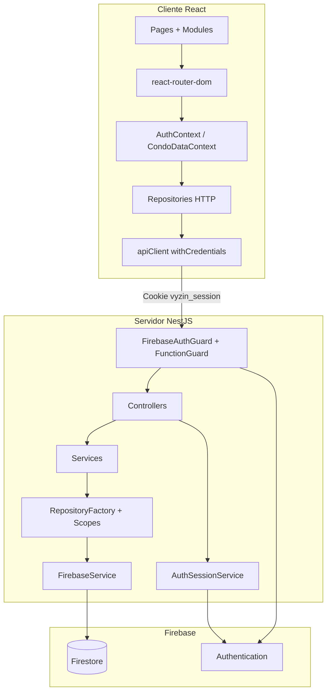
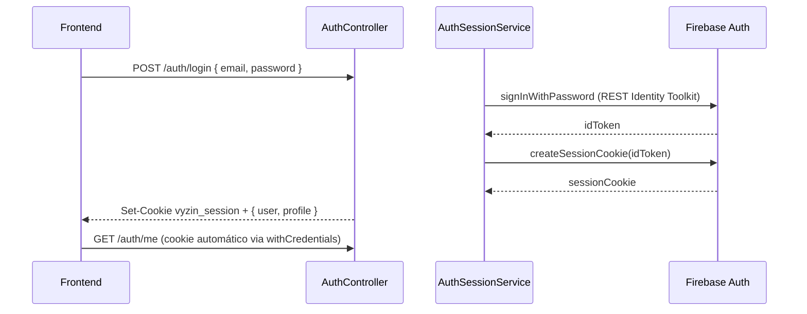

# Documentação técnica — Vyzin

**Projeto:** Vyzin — gestão condominial (MVP)  
**Organização:** monorepo (`frontend/` + `backend/`)  
**Versão:** integração completa frontend ↔ backend ↔ Firebase + emuladores locais + testes e2e  
**Última atualização:** junho/2026

Documentos relacionados: [índice](./README.md) · [regras de negócio](./REGRAS_DE_NEGOCIO.md) · [mapa do código](./MAPA_DO_CODIGO.md) · [testes](./TESTES.md) · [setup](./SETUP_TESTE.md)

---

## 1. Resumo executivo

O Vyzin é uma SPA React que consome uma API REST NestJS. A autenticação usa **Firebase Auth no servidor**: o frontend chama `POST /auth/login`, recebe um **cookie httpOnly** (`vyzin_session`) e nunca instancia o Firebase SDK. O backend valida a sessão, carrega o perfil do Firestore e aplica **RBAC dinâmico** via funções (`AppFunction`) e **security scopes** por entidade.

| Camada | Stack | Porta dev |
|--------|-------|-----------|
| Frontend | React 18, TypeScript, Vite, react-router-dom, Tailwind v4, shadcn/ui, Axios | 3001 |
| Backend | NestJS 11, TypeScript, class-validator, cookie-parser | 3000 |
| Persistência | Cloud Firestore (Admin SDK) | — |
| Auth | Firebase Auth (REST no backend + session cookie) | — |
| Dev local | Firebase Emulators (Auth + Firestore) | 4000 (UI) |

---

## 2. Arquitetura global

### 2.1 Diagrama de camadas


```mermaid
flowchart TB
  subgraph client [Cliente React]
    UI[Pages + Modules]
    Router[react-router-dom]
    CTX[AuthContext / CondoDataContext]
    REPO[Repositories HTTP]
    API[apiClient withCredentials]
  end

  subgraph server [Servidor NestJS]
    GUARDS[FirebaseAuthGuard + FunctionGuard]
    CTRL[Controllers]
    SVC[Services]
    REPO_F[RepositoryFactory + Scopes]
    AUTH_SRV[AuthSessionService]
    FB_SRV[FirebaseService]
  end

  subgraph firebase [Firebase]
    AUTH[Authentication]
    FS[(Firestore)]
  end

  UI --> Router --> CTX --> REPO --> API
  API -->|Cookie vyzin_session| GUARDS --> CTRL --> SVC --> REPO_F --> FB_SRV --> FS
  CTRL --> AUTH_SRV --> AUTH
  GUARDS --> AUTH
```

### 2.2 Monorepo

```
vyzin/
├── backend/
│   ├── src/
│   │   ├── auth/                 # Sessão, guards, catálogo AppFunction
│   │   ├── firebase/             # Admin SDK + detecção de emuladores
│   │   ├── persistence/          # Repository genérico + security scopes
│   │   ├── profiles/             # RBAC — perfis
│   │   ├── users/                # Usuários + provisionamento Auth
│   │   ├── reservas/             # Reservas, slots, espaços, vínculo visitantes
│   │   ├── visitantes/           # Visitantes + workflow portaria
│   │   ├── pre-authorizations/   # Pré-autorizados por morador
│   │   ├── mural/                # Avisos
│   │   ├── informacoes/          # Dados do condomínio (documento único)
│   │   ├── reports/              # Relatório operacional (joins)
│   │   ├── scripts/seed.ts       # Bootstrap idempotente
│   │   ├── app.module.ts
│   │   └── main.ts
│   ├── firebase.json             # Config emuladores
│   ├── requests.http             # Exemplos REST Client
│   └── test/                     # E2e (46 testes)
├── frontend/
│   └── src/app/
│       ├── pages/                # Wrappers finos por rota
│       ├── modules/              # Componentes de feature
│       ├── layouts/              # AppLayout, SegurancaLayout, RootLayout
│       ├── router/               # paths, guards, AppRouter
│       ├── components/           # Sidebar, Login, shadcn/ui
│       ├── contexts/             # AuthContext, CondoDataContext
│       ├── data/                 # Repositories HTTP
│       ├── domain/               # Tipos TypeScript
│       ├── infra/http/           # apiClient, queryParams
│       ├── services/             # authErrors, condoQueries
│       └── utils/                # permissions, dates, displayLabels
└── docs/
```

### 2.3 Mapeamento MVC

| Papel MVC | Vyzin |
|-----------|-------|
| **View** | Pages + modules React (`frontend/src/app/modules/`) |
| **Controller** | `@Controller()` NestJS — rotas HTTP, DTOs, decorators |
| **Model** | Entities + Firestore converters + Services + ScopedRepository |

---

## 3. Autenticação e sessão

### 3.1 Fluxo de login


```mermaid
sequenceDiagram
  participant UI as Frontend
  participant API as AuthController
  participant SVC as AuthSessionService
  participant FB as Firebase Auth

  UI->>API: POST /auth/login { email, password }
  SVC->>FB: signInWithPassword (REST Identity Toolkit)
  FB-->>SVC: idToken
  SVC->>FB: createSessionCookie(idToken)
  FB-->>SVC: sessionCookie
  API-->>UI: Set-Cookie vyzin_session + { user, profile }
  UI->>API: GET /auth/me (cookie automático via withCredentials)
```

### 3.2 Cookie de sessão

| Propriedade | Valor |
|-------------|-------|
| Nome | `vyzin_session` (constante `SESSION_COOKIE_NAME`) |
| httpOnly | `true` — inacessível via JavaScript |
| sameSite | `lax` |
| secure | `true` apenas em `NODE_ENV=production` |
| path | `/` |

### 3.3 Validação nas requisições (`FirebaseAuthGuard`)

Ordem de verificação:

1. Rota `@Public()` → permite sem auth (`GET /`, `POST /auth/login`, `POST /auth/logout`)
2. Cookie `vyzin_session` → `verifySessionCookie`
3. Header `Authorization: Bearer <idToken>` → `verifyIdToken` (fallback para REST Client / integrações)
4. Em testes (`NODE_ENV=test`): token `Bearer test:<profileId>` → usuário mock

Após autenticação, `request.user` contém `{ uid, email }`. As **funções** não vêm do token — são carregadas pelo `FunctionGuard` a partir do Firestore.

### 3.4 FunctionGuard — RBAC em tempo real

O `FunctionGuard` **sempre** consulta Firestore:

1. Busca `users/{uid}` → obtém `profileId`
2. Busca `profiles/{profileId}` → obtém `functions[]`
3. Valida `@RequireFunction(...)` do handler

Isso garante que alterações de perfil no Firestore surtam efeito sem depender de claims desatualizadas no JWT.

### 3.5 Logout

`POST /auth/logout` revoga refresh tokens no Firebase, limpa o cookie e retorna `{ ok: true }`.

### 3.6 Frontend — AuthContext

| Arquivo | Responsabilidade |
|---------|------------------|
| `data/authRepository.ts` | `login`, `logout`, `getMe` |
| `infra/http/apiClient.ts` | Axios com `withCredentials: true` |
| `contexts/AuthContext.tsx` | Estado global do usuário logado |
| `components/Login.tsx` | Formulário de login |

**Removido:** Firebase SDK no cliente (`firebaseClient.ts`, `FirebaseAuthService.ts`).

---

## 4. Camada de persistência (`backend/src/persistence/`)

Abstração genérica sobre Firestore com autorização por entidade.

| Componente | Arquivo | Responsabilidade |
|------------|---------|------------------|
| `IRepository` | `interfaces/repository.interface.ts` | Contrato CRUD |
| `FirestoreRepository` | `firestore/firestore.repository.ts` | Acesso Firestore tipado |
| `ScopedRepository` | `firestore/scoped.repository.ts` | Decorator que aplica scope em read/write |
| `RepositoryFactory` | `firestore/repository.factory.ts` | Factory por entidade (scoped / unscoped) |
| `ISecurityScope` | `interfaces/security-scope.interface.ts` | Filtros de lista + assertCanRead/Write |
| `OwnershipSecurityScope` | `scopes/ownership.security-scope.ts` | Ownership + bypass read/write separados |
| `applyTextSearch` | `utils/text-search.util.ts` | Busca textual pós-query (servidor) |

### Security scopes por entidade

| Entidade | Scope | Regra resumida |
|----------|-------|----------------|
| Reservas | `ReservationSecurityScope` | Morador vê/edita próprias; admin `manage_all`; porteiro lê todas |
| Visitantes | `VisitorSecurityScope` | Por `createdBy`; bypass com `visitors:workflow` |
| Pré-autorizados | `PreAuthorizationSecurityScope` | Por `createdBy` (morador vê só os seus) |
| Usuários | `UserSecurityScope` | Porteiro vê só moradores |
| Avisos / Perfis / Informações | `OpenSecurityScope` | RBAC apenas via `@RequireFunction` |

Services usam `repositoryFactory.reservations({ user })` para operações autenticadas e `*Unscoped()` para joins internos (ex.: lookup de usuário no relatório).

---

## 5. Backend (NestJS)

### 5.1 Bootstrap — `main.ts`

- `cookie-parser` habilitado
- CORS com `credentials: true` para `FRONTEND_ORIGIN` (padrão `http://localhost:3001`)
- `ValidationPipe` global (`whitelist`, `transform`)
- Porta: `process.env.PORT ?? 3000`

### 5.2 Módulo raiz — `app.module.ts`

Importa: `ConfigModule`, `FirebaseModule`, `PersistenceModule`, `AuthModule`, `ProfilesModule`, `UsersModule`, `ReservationsModule`, `VisitorsModule`, `PreAuthorizationsModule`, `MuralModule`, `InformationModule`, `ReportsModule`.

### 5.3 Firebase — `FirebaseService`

Credenciais (ordem de prioridade):

1. `GOOGLE_APPLICATION_CREDENTIALS`
2. `FIREBASE_SERVICE_ACCOUNT_JSON`
3. `firebase-key.json` no diretório `backend/`

**Emuladores:** quando `FIRESTORE_EMULATOR_HOST` e/ou `FIREBASE_AUTH_EMULATOR_HOST` estão definidos, o Admin SDK conecta aos emuladores locais (sem credencial real).

Scripts npm:

| Script | Uso |
|--------|-----|
| `npm run emulators` | Sobe Auth (9099) + Firestore (8080); UI em :4000 |
| `npm run start:dev:local` | Backend apontando para emuladores |
| `npm run seed:local` | Seed nos emuladores |

### 5.4 Catálogo de funções

Fonte única: `backend/src/auth/functions/app-functions.ts`  
Exposta ao frontend: `GET /functions` (requer `profiles:read`)

| Função | Descrição |
|--------|-----------|
| `reservations:read` | Listar/visualizar reservas (escopo por perfil) |
| `reservations:manage` | CRUD das próprias reservas |
| `reservations:manage_all` | CRUD de qualquer reserva |
| `visitors:read` / `visitors:manage` / `visitors:workflow` | Visitantes |
| `announcements:read` / `announcements:manage` | Mural |
| `information:read` / `information:edit` | Informações do condomínio |
| `users:read` / `users:manage` | Usuários |
| `profiles:read` / `profiles:manage` | Perfis RBAC |
| `reports:read` | Relatório operacional |

### 5.5 Modelo de dados (Firestore)

| Coleção | Documento / ID | Campos principais |
|---------|----------------|-------------------|
| `profiles` | `{profileId}` | `name`, `functions[]`, `isSystem` |
| `users` | `{uid}` | `name`, `email`, `cpf`, `phone`, `apartment?`, `block?`, `profileId` |
| `reservations` | auto | `space`, `date`, `startTime`, `endTime`, `status`, `createdBy`, `linkedVisitorIds[]` |
| `visitors` | auto | `name`, `cpf`, `visitType`, `status`, `createdBy`, `date`, `time`, … |
| `preAuthorizations` | auto | `name`, `cpf`, `type`, `createdBy`, … |
| `announcements` | auto | `title`, `content`, `author`, `category`, `isPinned`, … |
| `condoInformation` | `default` | contatos, regras, documentos, endereço |

### 5.6 API REST — referência completa

**Base:** `http://localhost:3000`  
**Auth:** cookie `vyzin_session` (recomendado) ou `Authorization: Bearer <token>`

#### Auth

| Método | Rota | Auth | Descrição |
|--------|------|------|-----------|
| POST | `/auth/login` | pública | Login; retorna user + profile; seta cookie |
| POST | `/auth/logout` | pública | Limpa sessão |
| GET | `/auth/me` | autenticado | Usuário + perfil + funções |
| GET | `/functions` | `profiles:read` | Catálogo de funções |

#### Perfis e usuários

| Método | Rota | Função(ões) |
|--------|------|-------------|
| CRUD | `/profiles`, `/profiles/:id` | `profiles:read` / `profiles:manage` |
| CRUD | `/users`, `/users/:id` | `users:read` / `users:manage` |

#### Reservas

| Método | Rota | Função(ões) |
|--------|------|-------------|
| GET | `/reservations` | `reservations:read` |
| GET | `/reservations/spaces` | `reservations:read` |
| GET | `/reservations/available-slots` | `reservations:read` |
| GET | `/reservations/:id` | `reservations:read` |
| POST | `/reservations` | `reservations:manage` |
| PUT | `/reservations/:id` | `reservations:manage` |
| DELETE | `/reservations/:id` | `reservations:manage` |
| POST | `/reservations/:id/visitors/:visitorId` | `visitors:manage` |
| DELETE | `/reservations/:id/visitors/:visitorId` | `visitors:manage` |

**Validações:** data não pode ser passada; slot deve estar disponível (`assertSlotAvailable`).

#### Visitantes

| Método | Rota | Função(ões) |
|--------|------|-------------|
| CRUD | `/visitors`, `/visitors/:id` | `visitors:read` / `visitors:manage` |
| PATCH | `/visitors/:id/status` | `visitors:workflow` |

**Validações:** data/horário da visita não podem ser no passado (`assertNotInPast`).

#### Pré-autorizados

| Método | Rota | Função(ões) |
|--------|------|-------------|
| CRUD | `/pre-authorizations`, `/pre-authorizations/:id` | `visitors:read` / `visitors:manage` |

Escopo: morador vê/edita apenas registros com `createdBy === uid`.

#### Mural

| Método | Rota | Função(ões) |
|--------|------|-------------|
| CRUD | `/announcements`, `/announcements/:id` | `announcements:read` / `announcements:manage` |

#### Informações

| Método | Rota | Função(ões) |
|--------|------|-------------|
| GET | `/information` | `information:read` |
| PUT | `/information` | `information:edit` |

Documento único em `condoInformation/default`.

#### Relatório

| Método | Rota | Função(ões) |
|--------|------|-------------|
| GET | `/reports/operational` | `reports:read` |

**Filtros de query comuns:** `status`, `date`, `search`. Relatório: `from`, `to`, `reservationStatus`, `space`, `visitorStatus`, `visitType`, `search`.

Exemplos executáveis: `backend/requests.http`.

### 5.7 Regras implementadas nos services

| Service | Regra chave |
|---------|-------------|
| `ReservationsService` | `assertNotInPast` na data; `assertSlotAvailable`; revalidação só se horário/espaço mudou |
| `VisitorsService` | Status default `waiting`; `createdBy` = uid; `assertNotInPast` em data/horário |
| `PreAuthorizationsService` | Escopo por `createdBy`; CRUD com `visitors:manage` |
| `InformationService` | GET/PUT documento `condoInformation/default` |
| `ProfilesService` | Perfil sempre lido do Firestore; seed merge de novas funções |
| `ReportsService` | Joins reserva→user→perfil, reserva→visitantes, visitante→autorizador |
| `AuthSessionService` | Login REST + session cookie; logout revoga tokens |
| `UsersService` | Provisiona Auth + claim + Firestore |

### 5.8 Seed

```bash
# Emuladores (recomendado)
cd backend && npm run seed:local

# Firebase real
cd backend && npm run seed
```

Idempotente — perfis `admin`, `doorman`, `resident`; merge de funções novas; admin sempre recebe `ALL_FUNCTIONS`.

### 5.9 Swagger (OpenAPI)

Documentação interativa gerada com `@nestjs/swagger`.

| Recurso | URL |
|---------|-----|
| Swagger UI | http://localhost:3000/api/docs |
| OpenAPI JSON | http://localhost:3000/api/docs-json |

**Arquivos:**

| Arquivo | Responsabilidade |
|---------|------------------|
| `src/swagger/swagger.config.ts` | Título, descrição, tags, esquemas de auth, setup da UI |
| `src/swagger/api-secured.decorator.ts` | `@ApiSecured()` — cookie + Bearer nos controllers |
| `src/swagger/swagger.constants.ts` | Nome do scheme Bearer |
| `nest-cli.json` | Plugin Swagger (gera schemas dos DTOs via class-validator) |

**Como testar no Swagger UI:**

1. Backend rodando (`npm run start:dev` ou `start:dev:local`)
2. Abrir http://localhost:3000/api/docs
3. **Auth** → `POST /auth/login` → **Try it out** → **Execute** com credenciais do seed
4. Cookie `vyzin_session` gravado no navegador (`withCredentials: true`)
5. Demais rotas autenticadas funcionam sem clicar em **Authorize**

**Authorize (cadeado):** opcional. Use `bearer` apenas se tiver um Firebase ID token; o fluxo normal é login via cookie.

Alternativa manual: `backend/requests.http` (REST Client).

---

## 6. Frontend (React)

### 6.1 Entrada e roteamento

- `index.html` → `main.tsx` → `App.tsx` → `AppRouter`
- Rotas em `router/index.tsx`; paths centralizados em `router/paths.ts`
- `RequirePermission` redireciona ao dashboard se flag ausente
- Layouts: `RootLayout` (login), `AppLayout` (sidebar + outlet), `SegurancaLayout` (submenu)

### 6.2 Estrutura por feature

| Rota | Page | Module |
|------|------|--------|
| `/dashboard` | `pages/dashboard/page.tsx` | `modules/dashboard/VyzinDashboard` |
| `/reservations` | `pages/reservations/page.tsx` | `modules/reservations/Reservas` |
| `/visitantes` | `pages/visitantes/page.tsx` | `modules/visitantes/Visitantes` |
| `/mural` | `pages/mural/page.tsx` | `modules/mural/MuralAvisos` |
| `/relatorio` | `pages/relatorio/page.tsx` | `modules/relatorio/RelatorioOperacional` |
| `/informacoes` | `pages/informacoes/page.tsx` | `modules/informacoes/Informacoes` + `InformacoesEditDialog` |
| `/seguranca/usuarios` | `pages/seguranca/usuarios/page.tsx` | `modules/seguranca/usuarios/UserManagement` |
| `/seguranca/perfis` | `pages/seguranca/perfis/page.tsx` | `modules/seguranca/perfis/ProfileManagement` |

### 6.3 Camadas

| Camada | Pasta | Responsabilidade |
|--------|-------|------------------|
| Domínio | `domain/` | Tipos: user, profile, reservation, visitor, announcement, report, information, preAuthorization |
| Infra | `infra/http/` | `apiClient` (withCredentials), `queryParams` |
| Dados | `data/` | Repositories HTTP |
| Contextos | `contexts/` | Auth + dados condomínio (cache para vínculos) |
| Políticas | `utils/permissions.ts` | Flags UI derivadas de `AppFunction[]` |
| Utilitários | `utils/dates.ts` | `todayISO`, `isVisitSlotInPast` |

### 6.4 Repositories

| Repository | Endpoints principais |
|------------|---------------------|
| `authRepository` | `/auth/login`, `/auth/logout`, `/auth/me` |
| `reservationRepository` | `/reservations`, `/spaces`, `/available-slots`, link/unlink |
| `visitorRepository` | `/visitors`, `/visitors/:id/status` |
| `preAuthorizationRepository` | `/pre-authorizations` |
| `announcementRepository` | `/announcements` |
| `informationRepository` | `/information` |
| `userRepository` | `/users` |
| `profileRepository` | `/profiles` |
| `reportRepository` | `/reports/operational` |

### 6.5 Navegação e RBAC na UI

`Sidebar.tsx` filtra itens por `getUserPermissions(functions)`.

| Rota | Permissão UI |
|------|--------------|
| `/dashboard` | `canAccessDashboard` (sempre) |
| `/reservations` | `canAccessReservations` |
| `/mural` | `canAccessNoticeBoard` |
| `/visitantes` | `canAccessVisitors` |
| `/relatorio` | `canAccessReports` |
| `/informacoes` | `canAccessInformation` |
| `/seguranca/usuarios` | `canManageUsers` |
| `/seguranca/perfis` | `canAccessProfiles` |

### 6.6 Validações na UI

| Tela | Validação |
|------|-----------|
| Visitantes | `min={todayISO()}` no campo data; slots passados desabilitados via `isVisitSlotInPast` |
| Reservas | Espaços e slots carregados da API (`GET /reservations/spaces`) |
| Informações | Botão editar visível apenas com `information:edit` |

---

## 7. Relatório operacional

**Endpoint:** `GET /reports/operational`

**Joins aplicados:**

```
Reserva.createdBy        → User (nome, email, apto, bloco) → Profile.name
Reserva.linkedVisitorIds → Visitor[]
Visitor.createdBy        → User → Profile
Visitor.id               → Reservation (lookup reverso em linkedVisitorIds)
```

Respeita security scopes: morador vê apenas dados permitidos; porteiro/admin veem escopo ampliado conforme perfil.

**Frontend:** filtros de período, status, espaço, busca; abas Reservas/Visitantes; export CSV.

---

## 8. Execução local

### Recomendado — emuladores

| Terminal | Comando |
|----------|---------|
| 1 | `cd backend && npm run emulators` |
| 2 | `cd backend && npm run start:dev:local` |
| 3 | `cd backend && npm run seed:local` (primeira vez) |
| 4 | `cd frontend && npm run dev` |

Guia completo: [SETUP_TESTE.md](./SETUP_TESTE.md).

### Build

```bash
cd backend && npm run build
cd frontend && npm run build
```

---

## 9. Testes automatizados

| Suite | Comando | Quantidade |
|-------|---------|------------|
| Backend unitários | `npm test` | 14 testes |
| Backend e2e | `npm run test:e2e` | 46 testes (todos endpoints) |
| Frontend Vitest | `npm test` | 6 testes |

Detalhes: [TESTES.md](./TESTES.md).

---

## 10. Limitações conhecidas (MVP)

| Item | Estado |
|------|--------|
| Likes/comentários avisos | Campos numéricos sem API de interação |
| Multi-condomínio | Não suportado (documento `condoInformation/default` único) |
| Export PDF | Não implementado (CSV disponível no relatório) |
| Firestore produção | Projeto `vyzin-app` pode atingir cota — use emuladores localmente |

---

## 11. Referências

- [NestJS](https://docs.nestjs.com) · [React](https://react.dev) · [Vite](https://vite.dev) · [Firebase Emulators](https://firebase.google.com/docs/emulator-suite)
- [MAPA_DO_CODIGO.md](./MAPA_DO_CODIGO.md) — referência arquivo a arquivo

---

_Documento técnico do repositório Vyzin. Para visão de produto, ver [PRODUTO_E_PROJETO.md](./PRODUTO_E_PROJETO.md)._
