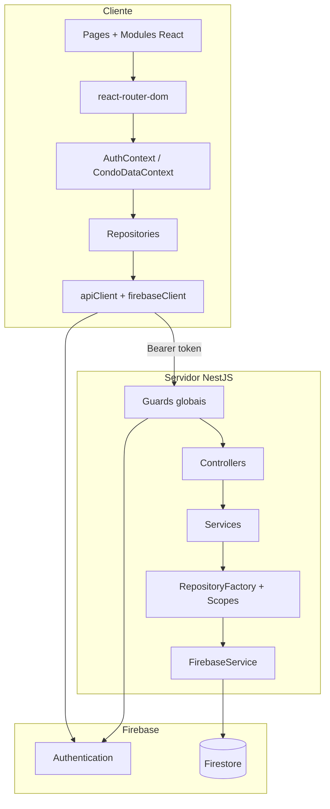

# Documentação técnica — Vyzin

**Projeto:** Vyzin — gestão condominial (MVP)  
**Organização:** monorepo (`frontend/` + `backend/`)  
**Versão:** integração frontend ↔ backend ↔ Firebase + relatórios + persistence layer  
**Última atualização:** junho/2026

Documentos relacionados: [índice](./README.md) · [regras de negócio](./REGRAS_DE_NEGOCIO.md) · [casos de uso](./CASOS_DE_USO.md) · [setup](./SETUP_TESTE.md)

---

## 1. Resumo executivo

O Vyzin é uma SPA React que consome uma API REST NestJS. A autenticação usa **Firebase Auth** no cliente; o backend valida o **ID token** e aplica **RBAC dinâmico** via perfis e funções. Persistência no **Firestore** (Admin SDK) através de uma **camada de repositório genérica** com **security scopes** por entidade.

| Camada | Stack | Porta dev |
|--------|-------|-----------|
| Frontend | React, TypeScript, Vite, react-router-dom, Tailwind v4, shadcn/ui, Axios | 3001 |
| Backend | NestJS, TypeScript, class-validator | 3000 |
| Nuvem | Firebase Auth + Firestore (`vyzin-app`) | — |

---

## 2. Arquitetura global

### 2.1 Diagrama de camadas


```mermaid
flowchart TB
  subgraph client [Cliente]
    UI[Pages + Modules React]
    Router[react-router-dom]
    CTX[AuthContext / CondoDataContext]
    REPO[Repositories]
    API_CLIENT[apiClient + firebaseClient]
  end

  subgraph server [Servidor NestJS]
    GUARDS[Guards globais]
    CTRL[Controllers]
    SVC[Services]
    REPO_F[RepositoryFactory + Scopes]
    FB_SRV[FirebaseService]
  end

  subgraph firebase [Firebase]
    AUTH[Authentication]
    FS[(Firestore)]
  end

  UI --> Router --> CTX --> REPO --> API_CLIENT
  API_CLIENT -->|Bearer token| GUARDS --> CTRL --> SVC --> REPO_F --> FB_SRV --> FS
  API_CLIENT --> AUTH
  GUARDS --> AUTH
```

### 2.2 Monorepo

```
vyzin/
├── backend/
│   ├── src/
│   │   ├── auth/              # Guards, decorators, catálogo AppFunction
│   │   ├── firebase/          # Admin SDK
│   │   ├── persistence/       # Repository genérico + security scopes
│   │   ├── profiles/          # RBAC — perfis
│   │   ├── users/             # Usuários + Firebase Auth provisioning
│   │   ├── reservas/          # Reservas, slots, vínculo visitantes
│   │   ├── visitantes/        # Visitantes + workflow
│   │   ├── mural/             # Avisos
│   │   ├── reports/           # Relatório operacional (joins)
│   │   ├── scripts/seed.ts    # Bootstrap idempotente
│   │   ├── app.module.ts
│   │   └── main.ts
│   ├── requests.http
│   └── firebase-key.json      # Dev local (gitignored)
├── frontend/
│   └── src/app/
│       ├── pages/             # Wrappers finos por rota
│       ├── modules/           # Componentes de feature por domínio
│       ├── layouts/           # AppLayout, SegurancaLayout, RootLayout
│       ├── router/            # paths, guards, AppRouter
│       ├── components/        # Sidebar, Login, shadcn/ui
│       ├── contexts/          # AuthContext, CondoDataContext
│       ├── data/              # Repositories HTTP
│       ├── domain/            # Tipos TypeScript
│       ├── infra/             # firebaseClient, apiClient, queryParams
│       ├── services/          # AuthService, condoQueries
│       └── utils/             # permissions.ts, displayLabels.ts
└── docs/
```

### 2.3 Mapeamento MVC

| Papel MVC | Vyzin |
|-----------|-------|
| **View** | Pages + modules React (`frontend/src/app/modules/`) |
| **Controller** | `@Controller()` NestJS — rotas HTTP, DTOs, decorators |
| **Model** | Entities + Firestore converters + Services + ScopedRepository |

---

## 3. Camada de persistência (`backend/src/persistence/`)

Abstração genérica sobre Firestore com autorização por entidade.

| Componente | Arquivo | Responsabilidade |
|------------|---------|------------------|
| `IRepository` | `interfaces/repository.interface.ts` | Contrato CRUD |
| `FirestoreRepository` | `firestore/firestore.repository.ts` | Acesso Firestore tipado |
| `ScopedRepository` | `firestore/scoped.repository.ts` | Decorator que aplica scope em read/write |
| `RepositoryFactory` | `firestore/repository.factory.ts` | Factory por entidade (scoped / unscoped) |
| `ISecurityScope` | `interfaces/security-scope.interface.ts` | Filtros de lista + assertCanRead/Write |
| `OwnershipSecurityScope` | `scopes/ownership.security-scope.ts` | Ownership + bypass read/write separados |
| `applyTextSearch` | `utils/text-search.util.ts` | Busca textual pós-query (servidor) |

### Security scopes por entidade

| Entidade | Scope | Regra resumida |
|----------|-------|----------------|
| Reservas | `ReservationSecurityScope` | Morador vê/edita próprias; admin `manage_all`; porteiro lê todas (sem `manage`) |
| Visitantes | `VisitorSecurityScope` | Por `authorizedBy`; bypass com `visitors:workflow` |
| Usuários | `UserSecurityScope` | Porteiro vê só moradores |
| Avisos / Perfis | `OpenSecurityScope` | RBAC apenas via `@RequireFunction` |

Services usam `repositoryFactory.reservations({ user })` para operações autenticadas e `*Unscoped()` para joins internos (ex.: lookup de usuário no relatório).

---

## 4. Backend (NestJS)

### 4.1 Bootstrap — `main.ts`

- CORS habilitado para `FRONTEND_ORIGIN` (padrão `http://localhost:3001`)
- `ValidationPipe` global (`whitelist`, `transform`)
- Porta: `process.env.PORT ?? 3000`

### 4.2 Módulo raiz — `app.module.ts`

Importa: `ConfigModule`, `FirebaseModule`, `PersistenceModule`, `AuthModule`, `ProfilesModule`, `UsersModule`, `ReservationsModule`, `VisitorsModule`, `MuralModule`, `ReportsModule`.

### 4.3 Firebase — `FirebaseService`

Credenciais (ordem de prioridade):

1. `GOOGLE_APPLICATION_CREDENTIALS`
2. `FIREBASE_SERVICE_ACCOUNT_JSON`
3. `firebase-key.json` no diretório `backend/`

### 4.4 Autenticação e RBAC

#### Guards globais (`AuthModule`)

1. **`FirebaseAuthGuard`** — Bearer token → `verifyIdToken` → `request.user` (`uid`, `email`, `profileId`)
2. **`FunctionGuard`** — carrega perfil via `ProfilesService.get(profileId)` → `user.functions[]` → valida `@RequireFunction`

#### Catálogo de funções

Fonte única: `backend/src/auth/functions/app-functions.ts`  
Exposta ao frontend: `GET /functions` (requer `profiles:read`)

| Função | Descrição |
|--------|-----------|
| `reservations:read` | Listar/visualizar reservas (escopo por perfil) |
| `reservations:manage` | CRUD das próprias reservas |
| `reservations:manage_all` | CRUD de qualquer reserva |
| `visitors:read` / `visitors:manage` / `visitors:workflow` | Visitantes |
| `announcements:read` / `announcements:manage` | Mural |
| `information:read` / `information:edit` | Informações (UI) |
| `users:read` / `users:manage` | Usuários |
| `profiles:read` / `profiles:manage` | Perfis RBAC |
| `reports:read` | Relatório operacional |

### 4.5 Modelo de dados (Firestore)

| Coleção | Campos principais | Relacionamentos |
|---------|-------------------|-----------------|
| `profiles` | `id`, `name`, `functions[]`, `isSystem` | → `users.profileId` |
| `users` | `uid`, `name`, `email`, `cpf`, `phone`, `apartment?`, `block?`, `profileId` | claim `{ profileId }` |
| `reservations` | `space`, `date`, `startTime`, `endTime`, `status`, `createdBy`, `linkedVisitorIds[]` | `createdBy` → user |
| `visitors` | `name`, `cpf`, `visitType`, `status`, `authorizedBy`, … | `authorizedBy` → user |
| `announcements` | `title`, `content`, `author`, `category`, `isPinned`, … | `author` string (sem FK) |

### 4.6 API REST — referência

**Base:** `http://localhost:3000`  
**Auth:** `Authorization: Bearer <Firebase ID token>`

| Método | Rota | Função(ões) |
|--------|------|---------------|
| GET | `/` | pública |
| GET | `/auth/me` | autenticado |
| GET | `/functions` | `profiles:read` |
| CRUD | `/profiles`, `/profiles/:id` | `profiles:read` / `profiles:manage` |
| CRUD | `/users`, `/users/:id` | `users:read` / `users:manage` |
| GET/POST/PUT/DELETE | `/reservations`, `/reservations/:id` | `reservations:read` / `reservations:manage` |
| GET | `/reservations/available-slots` | `reservations:read` |
| POST/DELETE | `/reservations/:id/visitors/:visitorId` | `visitors:manage` (vínculo dedicado) |
| CRUD | `/visitors`, `/visitors/:id` | `visitors:read` / `visitors:manage` |
| PATCH | `/visitors/:id/status` | `visitors:workflow` |
| CRUD | `/announcements`, `/announcements/:id` | `announcements:read` / `announcements:manage` |
| GET | `/reports/operational` | `reports:read` |

**Filtros de query comuns:** `status`, `date`, `search` (busca no servidor). Relatório: `from`, `to`, `reservationStatus`, `space`, `visitorStatus`, `visitType`, `search`.

Respostas de reserva incluem enriquecimento: `createdByName`, `createdByEmail`, `createdByDisplay`.

Exemplos: `backend/requests.http`.

### 4.7 Regras implementadas nos services

| Service | Regra chave |
|---------|-------------|
| `ReservationsService` | Validação de slot (`assertSlotAvailable`); revalidação só se horário/espaço mudou; `linkVisitor`/`unlinkVisitor` com auth dedicada |
| `VisitorsService` | Status default `waiting`; `authorizedBy` = uid do operador |
| `ProfilesService` | Perfil sempre lido do Firestore; seed merge de novas funções |
| `ReportsService` | Joins: reserva→user→perfil, reserva→visitantes, visitante→autorizador→reserva |
| `UsersService` | Provisiona Auth + claim + Firestore |

### 4.8 Seed

```bash
cd backend && npm run seed
```

Idempotente — perfis `admin`, `doorman`, `resident`; merge de funções novas em perfis existentes; admin sempre recebe catálogo completo (`ALL_FUNCTIONS`).

---

## 5. Frontend (React)

### 5.1 Entrada e roteamento

- `index.html` → `main.tsx` → `App.tsx` → `AppRouter`
- Rotas em `router/index.tsx`; paths centralizados em `router/paths.ts`
- `RequirePermission` redireciona ao dashboard se flag ausente
- Layouts: `RootLayout` (login), `AppLayout` (sidebar + outlet), `SegurancaLayout` (submenu)

### 5.2 Estrutura por feature

| Rota | Page | Module |
|------|------|--------|
| `/dashboard` | `pages/dashboard/page.tsx` | `modules/dashboard/VyzinDashboard` |
| `/reservations` | `pages/reservations/page.tsx` | `modules/reservations/Reservas` |
| `/visitantes` | `pages/visitantes/page.tsx` | `modules/visitantes/Visitantes` |
| `/mural` | `pages/mural/page.tsx` | `modules/mural/MuralAvisos` |
| `/relatorio` | `pages/relatorio/page.tsx` | `modules/relatorio/RelatorioOperacional` |
| `/informacoes` | `pages/informacoes/page.tsx` | `modules/informacoes/Informacoes` |
| `/seguranca/usuarios` | `pages/seguranca/usuarios/page.tsx` | `modules/seguranca/usuarios/UserManagement` |
| `/seguranca/perfis` | `pages/seguranca/perfis/page.tsx` | `modules/seguranca/perfis/ProfileManagement` |

### 5.3 Camadas

| Camada | Pasta | Responsabilidade |
|--------|-------|------------------|
| Domínio | `domain/` | Tipos: user, profile, reservation, visitor, announcement, report, appFunction |
| Infra | `infra/` | `firebaseClient`, `apiClient`, `queryParams` |
| Dados | `data/` | Repositories HTTP |
| Contextos | `contexts/` | Auth + dados condomínio (cache local para vínculos) |
| Políticas | `utils/permissions.ts` | Flags UI derivadas de `AppFunction[]` |

### 5.4 Repositories

| Repository | Endpoints principais |
|------------|---------------------|
| `authRepository` | `/auth/me`, `/functions` |
| `reservationRepository` | `/reservations`, `/available-slots`, link/unlink visitante |
| `visitorRepository` | `/visitors`, `/visitors/:id/status` |
| `announcementRepository` | `/announcements` |
| `userRepository` | `/users` |
| `profileRepository` | `/profiles` |
| `reportRepository` | `/reports/operational` |

### 5.5 Navegação e RBAC na UI

`Sidebar.tsx` filtra itens por `getUserPermissions(functions)`.

| Rota | Permissão UI |
|------|--------------|
| `/dashboard` | `canAccessDashboard` (sempre) |
| `/reservations` | `canAccessReservations` |
| `/mural` | `canAccessNoticeBoard` |
| `/visitantes` | `canAccessVisitors` |
| `/relatorio` | `canAccessReports` |
| `/informacoes` | `canAccessInformation` |
| `/seguranca/usuarios` | `canManageUsers` |
| `/seguranca/perfis` | `canAccessProfiles` |

---

## 6. Relatório operacional

**Endpoint:** `GET /reports/operational`

**Joins aplicados:**

```
Reserva.createdBy        → User (nome, email, apto, bloco) → Profile.name
Reserva.linkedVisitorIds → Visitor[]
Visitor.authorizedBy     → User → Profile
Visitor.id               → Reservation (lookup reverso em linkedVisitorIds)
```

Respeita security scopes: morador vê apenas dados permitidos; porteiro/admin veem escopo ampliado conforme perfil.

**Frontend:** filtros de período, status, espaço, busca; abas Reservas/Visitantes; export CSV.

---

## 7. Execução local

| Passo | Comando |
|-------|---------|
| Backend | `cd backend && npm install && cp .env.example .env && npm run seed && npm run start:dev` |
| Frontend | `cd frontend && npm install && cp .env.example .env && npm run dev` |

Guia completo: [SETUP_TESTE.md](./SETUP_TESTE.md).

```bash
cd backend && npm run build
cd frontend && npm run build
```

---

## 8. Limitações conhecidas (MVP)

| Item | Estado |
|------|--------|
| Módulo Informações | Sem API; conteúdo estático no frontend |
| Likes/comentários avisos | Campos numéricos sem API de interação |
| Multi-condomínio | Não suportado |
| Dashboard — stats/cards | Parte dos números ainda mockados; avisos recentes vêm da API |
| Export PDF | Não implementado (CSV disponível no relatório) |

---

## 9. Referências

- [NestJS](https://docs.nestjs.com) · [React](https://react.dev) · [Vite](https://vite.dev) · [Firebase](https://firebase.google.com/docs)

---

_Documento técnico do repositório Vyzin. Para visão de produto, ver [PRODUTO_E_PROJETO.md](./PRODUTO_E_PROJETO.md)._
