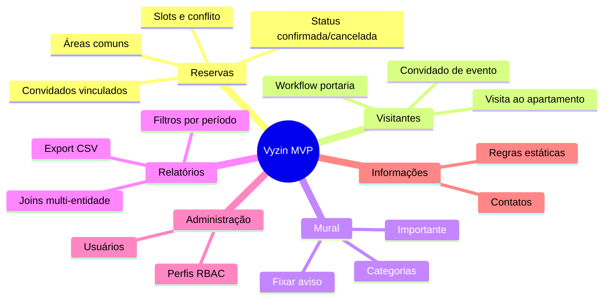

# Vyzin — Produto e Projeto

**Versão:** MVP integrado (frontend + backend + Firebase)  
**Última atualização:** junho/2026

---

## 1. O que é o Vyzin

O **Vyzin** é uma plataforma web para **gestão condominial**, pensada para centralizar rotinas do dia a dia de síndicos, porteiros e moradores em um único painel.

No estágio atual (MVP), o foco está em:

- **Reservas** de áreas comuns (salão, churrasqueiras, quadra, piscina, sala de reuniões)
- **Controle de visitantes** (cadastro, autorização na portaria, registro de saída)
- **Vínculo reserva ↔ convidados** (cadastro e associação na mesma reserva)
- **Mural de avisos** (comunicados, manutenções, eventos)
- **Relatório operacional** (joins entre reservas, visitantes, moradores e perfis; export CSV)
- **Informações do condomínio** (regras e contatos — conteúdo estático no MVP)
- **Gestão de usuários e perfis** (RBAC dinâmico)

O produto nasce no contexto de disciplinas de **Arquitetura de Software** e **Programação Web**, com requisitos explícitos de separação em camadas, MVC e persistência em nuvem.

---

## 2. Problema e proposta de valor

### Problema

Condomínios de médio porte costumam operar com planilhas, grupos de mensagem e cadernos na portaria. Isso gera:

- Falta de rastreabilidade (quem autorizou um visitante? quem reservou o salão?)
- Comunicação fragmentada (avisos perdidos em grupos)
- Dificuldade de definir **quem pode fazer o quê** (morador vs porteiro vs administrador)
- Ausência de visão consolidada para síndico e portaria

### Proposta de valor

| Benefício | Como o Vyzin entrega |
|-----------|----------------------|
| Centralização | Um painel web com módulos integrados e rotas dedicadas |
| Segurança operacional | RBAC por perfil + funções granulares + security scopes no backend |
| Rastreabilidade | Registros persistidos no Firestore com autor, ownership e joins |
| Escalabilidade de permissões | Perfis editáveis sem alterar código |
| Visão gerencial | Relatório operacional com filtros e exportação CSV |

---

## 3. Personas e perfis padrão

O MVP trabalha com três personas principais, materializadas como **perfis de sistema** no seed:

| Persona | Perfil (`profileId`) | Responsabilidades típicas |
|---------|----------------------|---------------------------|
| **Administrador / Síndico** | `admin` | Gestão completa: usuários, perfis, avisos, reservas de qualquer morador, relatórios |
| **Porteiro** | `doorman` | Autorizar visitantes, consultar todas as reservas, cadastrar visitantes, vincular convidados, relatórios |
| **Morador** | `resident` | Reservar áreas comuns, cadastrar visitantes, vincular convidados às próprias reservas, relatório dos próprios dados |

Usuários de demonstração (após `npm run seed`):

| E-mail | Senha | Apartamento |
|--------|-------|-------------|
| admin@vyzin.com | admin123 | 301, Bloco A |
| porteiro@vyzin.com | porteiro123 | — |
| morador@vyzin.com | morador123 | 114, Bloco M |

---

## 4. Escopo do MVP

### Dentro do escopo (implementado)

- [x] Autenticação Firebase (e-mail/senha) no frontend
- [x] API REST NestJS com validação de token e RBAC
- [x] Camada de persistência genérica com **security scopes** por entidade
- [x] CRUD de reservas, visitantes, avisos, usuários e perfis
- [x] Validação de **conflito de horário** por espaço/data (slots disponíveis)
- [x] Workflow de visitantes (aguardando → autorizado / negado → saída)
- [x] Vínculo reserva ↔ visitantes (`linkedVisitorIds` + endpoints dedicados)
- [x] Filtros e busca textual **no servidor** (reservas, visitantes, avisos, usuários)
- [x] **Relatório operacional** com joins e export CSV
- [x] Navegação por **react-router-dom** com guards de permissão
- [x] Seed idempotente com merge de novas funções em perfis existentes
- [x] Interface React com sidebar, painel e módulos por feature

### Fora do escopo (MVP)

- [ ] Módulo financeiro (taxas, boletos)
- [ ] Notificações push / e-mail
- [ ] App mobile nativo
- [ ] API de Informações do condomínio (conteúdo editável persistido)
- [ ] Encomendas, ocorrências, votação de assembleia
- [ ] Export PDF de relatórios
- [ ] Multi-condomínio (tenant isolation)

### Protótipo visual

A pasta `Vyzin 1.0/` contém export do Figma com telas adicionais (analytics, energia, etc.). **Não está integrada ao backend** — serve como referência de UI/UX futura.

---

## 5. Módulos funcionais (visão de produto)

---

## 6. Contexto de projeto (acadêmico)

### Objetivos de aprendizagem atendidos

| Requisito | Realização |
|-----------|------------|
| Arquitetura em camadas | Frontend (apresentação) + Backend (negócio + dados) |
| MVC | Controllers/Services no Nest; React como View; Firestore como persistência |
| Monólito modular | Um processo NestJS com módulos por domínio |
| Banco na nuvem | Firestore via Firebase Admin SDK |
| Padrões de projeto | Repository + Factory + Strategy (security scopes) + Decorator (`ScopedRepository`) |
| SOLID / GRASP | Inversão de dependência (`AuthService`), coesão por domínio, `Information Expert` nos perfis |

### Stack tecnológica

| Camada | Tecnologias |
|--------|-------------|
| Frontend | React 19, TypeScript, Vite, react-router-dom, Tailwind CSS v4, shadcn/ui, Radix UI, Axios |
| Backend | NestJS, TypeScript, class-validator, Firebase Admin SDK |
| Infra | Firebase Auth + Firestore (projeto `vyzin-app`) |
| Ferramentas | ESLint, Jest (backend), `requests.http` para testes manuais de API |

---

## 7. Roadmap sugerido (pós-MVP)

Priorização sugerida para evolução do produto:

1. **Informações persistidas** — backend + editor na tela Informações
2. **Notificações** — aviso novo, visitante aguardando autorização
3. **Export PDF** — relatórios e listagens
4. **Dashboard com dados reais** — substituir cards mockados por métricas da API
5. **Multi-condomínio** — `condoId` em todas as coleções

---

## 8. Métricas de sucesso (MVP)

| Métrica | Meta |
|---------|------|
| Fluxo login → dashboard | < 3 s em ambiente local |
| Cobertura de RBAC | Toda rota protegida por função no backend |
| Seed reproduzível | `npm run seed` idempotente com merge de funções |
| Documentação | Domínio, técnica, casos de uso e setup descritos |

---

## 9. Glossário

| Termo | Significado no Vyzin |
|-------|---------------------|
| **Perfil** | Conjunto nomeado de funções (`profiles/{id}`). Define o que o usuário pode fazer. |
| **Função** | Capacidade atômica (`reservations:read`, `reports:read`, etc.), mapeada a endpoints. |
| **Usuário** | Pessoa com conta Firebase + documento Firestore (`users/{uid}`). |
| **Custom claim** | Metadado no token Firebase: `{ profileId }`. |
| **Security scope** | Regra de filtro/ownership aplicada na camada de persistência por entidade. |
| **Workflow** | Transições de estado de visitante (autorizar, negar, registrar saída). |
| **Ownership** | Regra em que morador só altera registros criados por ele (`createdBy` / `authorizedBy`). |

---

## 10. Referências internas

- [REGRAS_DE_NEGOCIO.md](./REGRAS_DE_NEGOCIO.md)
- [DOCUMENTACAO_TECNICA.md](./DOCUMENTACAO_TECNICA.md)
- [CASOS_DE_USO.md](./CASOS_DE_USO.md)
- [SETUP_TESTE.md](./SETUP_TESTE.md)
