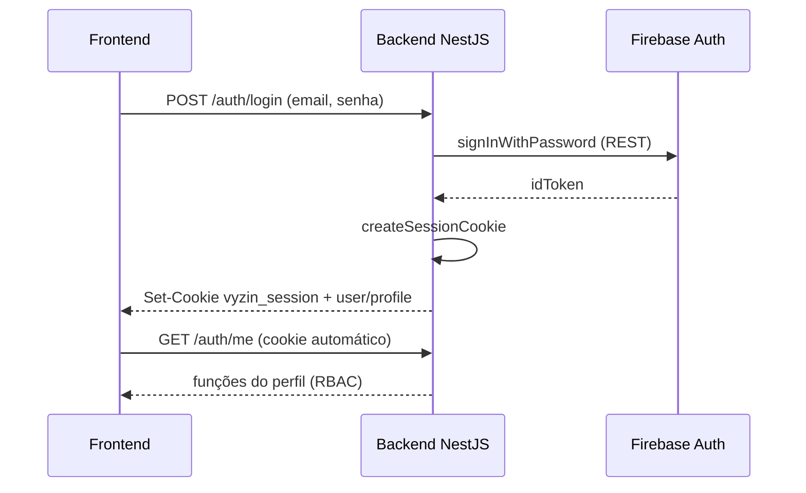

# Documentação Vyzin

Índice central da documentação do projeto **Vyzin** — gestão condominial (MVP).

**Última atualização:** junho/2026

---

## Por onde começar?

| Se você quer… | Leia |
|---------------|------|
| Entender o produto e o escopo | [PRODUTO_E_PROJETO.md](./PRODUTO_E_PROJETO.md) |
| Saber o que é permitido ou proibido | [REGRAS_DE_NEGOCIO.md](./REGRAS_DE_NEGOCIO.md) |
| Desenvolver ou dar manutenção | [DOCUMENTACAO_TECNICA.md](./DOCUMENTACAO_TECNICA.md) + [MAPA_DO_CODIGO.md](./MAPA_DO_CODIGO.md) |
| Subir o ambiente e testar manualmente | [SETUP_TESTE.md](./SETUP_TESTE.md) |
| Testar endpoints da API no browser | [DOCUMENTACAO_TECNICA.md § Swagger](./DOCUMENTACAO_TECNICA.md#59-swagger-openapi) → http://localhost:3000/api/docs |
| Ver fluxos de usuário | [CASOS_DE_USO.md](./CASOS_DE_USO.md) |
| Preparar apresentação N2 | [APRESENTACAO_N2.md](./APRESENTACAO_N2.md) |

---

## Catálogo de documentos

| Documento | Público | Descrição |
|-----------|---------|-----------|
| [PRODUTO_E_PROJETO.md](./PRODUTO_E_PROJETO.md) | Product, professores | Problema, valor, personas, MVP, roadmap |
| [REGRAS_DE_NEGOCIO.md](./REGRAS_DE_NEGOCIO.md) | QA, analistas, devs | Regras RN-* numeradas, matriz de perfis |
| [DOCUMENTACAO_TECNICA.md](./DOCUMENTACAO_TECNICA.md) | Desenvolvedores | Arquitetura, auth, API, Swagger, persistência, frontend |
| [MAPA_DO_CODIGO.md](./MAPA_DO_CODIGO.md) | Desenvolvedores | Referência arquivo a arquivo |
| [CASOS_DE_USO.md](./CASOS_DE_USO.md) | Todos | Casos de uso + diagramas Mermaid |
| [SETUP_TESTE.md](./SETUP_TESTE.md) | Devs / QA | Emuladores, env, seed, roteiro manual |
| [TESTES.md](./TESTES.md) | Devs | Jest, Vitest, cobertura de endpoints |
| [APRESENTACAO_N2.md](./APRESENTACAO_N2.md) | Equipe | Roteiro demo N2 (login, CRUDs, relatório) |

---

## Estrutura do repositório

```
vyzin/
├── frontend/                 # SPA React (porta 3001)
│   └── src/app/
│       ├── modules/          # Telas por domínio
│       ├── data/             # Repositories HTTP
│       ├── contexts/         # Auth + cache condomínio
│       └── domain/           # Tipos TypeScript
├── backend/                  # API NestJS (porta 3000)
│   └── src/
│       ├── auth/             # Sessão, guards, RBAC
│       ├── persistence/      # Firestore + security scopes
│       ├── */                # Módulos de domínio
│       └── scripts/seed.ts   # Bootstrap idempotente
├── docs/                     # Esta pasta
└── backend/firebase.json     # Config emuladores Auth + Firestore
```

---

## Módulos funcionais

| Módulo | Backend | Frontend | Observação |
|--------|---------|----------|------------|
| Painel | — | `/dashboard` | Stats e atalhos da API |
| Reservas | `/reservations` | `/reservations` | Slots, espaços via API |
| Visitantes | `/visitors` | `/visitantes` | Workflow + pré-autorizados |
| Pré-autorizados | `/pre-authorizations` | aba em `/visitantes` | Por morador |
| Mural | `/announcements` | `/mural` | |
| Informações | `/information` | `/informacoes` | Edição admin via dialog |
| Relatório | `/reports/operational` | `/relatorio` | Joins + CSV |
| Segurança | `/users`, `/profiles` | `/seguranca/*` | RBAC |

---

## Fluxo de autenticação (resumo)



O frontend **não** usa Firebase SDK — toda autenticação passa pela API.

---

## Execução rápida

Ver [README.md](../README.md) na raiz: emuladores → backend → seed → frontend.
