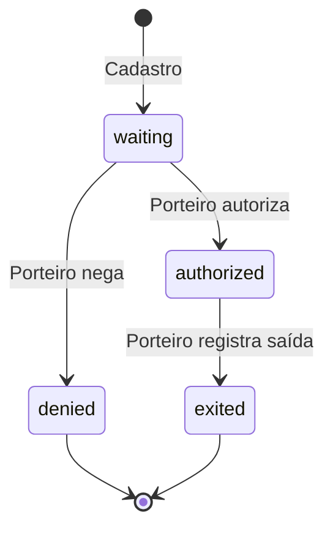

# Vyzin — Regras de Negócio

**Versão:** alinhada ao código em `backend/src/` e `frontend/src/app/`  
**Última atualização:** junho/2026

Este documento descreve **o que o sistema faz e não faz**, independentemente da implementação técnica. Para detalhes de código, consulte [DOCUMENTACAO_TECNICA.md](./DOCUMENTACAO_TECNICA.md).

---

## 1. Princípios gerais

| ID | Regra |
|----|-------|
| RN-01 | Toda operação sensível exige usuário autenticado (token Firebase válido). |
| RN-02 | Permissões são definidas por **perfil**, não hardcoded por papel fixo no código de negócio. |
| RN-03 | O backend é a **fonte de verdade** para autorização; o frontend apenas oculta UI. |
| RN-04 | Um usuário pertence a **exatamente um perfil** por vez (`profileId`). |
| RN-05 | Dados persistidos no Firestore; o Admin SDK no backend ignora regras de segurança do cliente. |

---

## 2. Autenticação e identidade

### RN-AUTH-01 — Login

- Login via **e-mail e senha** (Firebase Authentication).
- Após login, o frontend armazena o ID token e envia `Authorization: Bearer <token>` em toda requisição à API.

### RN-AUTH-02 — Custom claim

- Ao criar ou alterar o perfil de um usuário, o backend atualiza a custom claim Firebase: `{ profileId: "<id>" }`.
- O token carrega `profileId`; o backend carrega as **funções** a partir do documento do perfil no Firestore.

### RN-AUTH-03 — Sessão

- Logout remove o token local e encerra a sessão Firebase.
- Token expirado → API retorna 401; frontend redireciona ao login.

### RN-AUTH-04 — Endpoint `/auth/me`

- Retorna dados do usuário (`users/{uid}`) e perfil associado.
- Usado pelo frontend para montar menu e flags de permissão.

---

## 3. RBAC — Perfis e funções

### Modelo

```
Usuário ──profileId──► Perfil ──functions[]──► Funções ──► Endpoints
```

### RN-RBAC-01 — Catálogo de funções

Funções são identificadores estáveis (`area:acao`). Catálogo completo em `backend/src/auth/functions/app-functions.ts`:

| Função | Descrição |
|--------|-----------|
| `reservations:read` | Listar e visualizar reservas |
| `reservations:manage` | Criar, editar e excluir **próprias** reservas |
| `reservations:manage_all` | Criar, editar e excluir reservas de **qualquer** usuário |
| `visitors:read` | Listar e visualizar visitantes |
| `visitors:manage` | Cadastrar, editar e remover visitantes |
| `visitors:workflow` | Autorizar, negar e registrar saída (portaria) |
| `announcements:read` | Visualizar avisos |
| `announcements:manage` | Publicar, editar e remover avisos |
| `information:read` | Visualizar tela Informações |
| `information:edit` | Editar conteúdo (UI only no MVP; sem API) |
| `users:read` | Listar usuários |
| `users:manage` | Criar, editar e remover usuários |
| `profiles:read` | Listar perfis e catálogo de funções |
| `profiles:manage` | Criar, editar e remover perfis |

### RN-RBAC-02 — Perfis de sistema (seed)

| Perfil | ID | Funções (resumo) |
|--------|-----|------------------|
| Administrador | `admin` | Todas |
| Porteiro | `doorman` | Reservas (leitura), visitantes (CRUD + workflow), avisos (leitura), usuários (leitura + gestão) |
| Morador | `resident` | Reservas (leitura + próprias), visitantes (leitura + CRUD), avisos (leitura), informações (leitura) |

### RN-RBAC-03 — Guarda de funções

- Endpoints anotados com `@RequireFunction(...)` exigem que o usuário possua **todas** as funções listadas.
- Ausência de função → HTTP **403 Forbidden**.

### RN-RBAC-04 — Proteção contra lockout

Perfis marcados `isSystem: true` (ex.: `admin`):

- **Não podem ser excluídos.**
- **Não podem perder** as funções `profiles:manage` e `users:manage` (evita bloquear toda a administração).

### RN-RBAC-05 — Exclusão de perfil

- Perfil com usuários vinculados **não pode ser excluído** (409 Conflict).
- Perfis de sistema **não podem ser excluídos**.

### RN-RBAC-06 — Perfis customizados

- Administrador pode criar perfis com subconjunto arbitrário de funções.
- Novos perfis nascem com `isSystem: false`.

---

## 4. Usuários

### RN-USER-01 — Criação

- Cria conta no Firebase Auth (e-mail, senha, displayName).
- Grava documento `users/{uid}` com dados pessoais e `profileId`.
- Define custom claim `{ profileId }`.

### RN-USER-02 — Campos

| Campo | Obrigatório | Observação |
|-------|-------------|------------|
| name | Sim | Nome completo |
| email | Sim | Único no Firebase Auth |
| cpf | Sim | Identificação |
| phone | Sim | Contato |
| profileId | Sim | Deve existir em `profiles` |
| apartment | Não | Típico para moradores |
| block | Não | Bloco/torre |

### RN-USER-03 — Atualização

- E-mail **não é alterável** pela API de update (permanece o da criação).
- Mudança de `profileId` → atualiza custom claim imediatamente.

### RN-USER-04 — Exclusão

- Remove usuário do Firebase Auth **e** documento Firestore.

### RN-USER-05 — Quem gerencia

- Requer função `users:manage`.
- Porteiro (perfil seed) possui `users:manage` para cadastro operacional na portaria.

---

## 5. Reservas

### RN-RES-01 — Entidade

| Campo | Tipo / valores | Regra |
|-------|----------------|-------|
| space | string | Nome da área (salão, churrasqueira, etc.) |
| date | data | Dia da reserva |
| startTime / endTime | string (HH:mm) | Intervalo solicitado |
| status | `confirmed` \| `cancelled` | Estado da reserva |
| notes | string | Observações opcionais |
| createdBy | uid | Preenchido automaticamente na criação |
| linkedVisitorIds | string[] | IDs de visitantes tipo `reservation` |

### RN-RES-02 — Criação

- Requer `reservations:manage`.
- `createdBy` = uid do usuário autenticado (não pode ser informado pelo cliente para outro usuário).

### RN-RES-03 — Ownership (alteração e exclusão)

Morador com apenas `reservations:manage`:

- Pode **editar** e **excluir** somente reservas onde `createdBy === seu uid`.
- Tentativa sobre reserva de terceiro → **403 Forbidden**.

Usuário com `reservations:manage_all` (administrador):

- Pode editar e excluir **qualquer** reserva.

### RN-RES-04 — Leitura

- Requer `reservations:read`.
- No MVP, quem possui leitura vê **todas** as reservas (não há filtro por morador na API).

### RN-RES-05 — Filtros

- `?status=confirmed|cancelled`
- `?date=YYYY-MM-DD` (intervalo do dia inteiro)

### RN-RES-06 — Conflito de horário

- **Não implementado no MVP.** Duas reservas no mesmo espaço/horário podem coexistir.

### RN-RES-07 — Vínculo com visitantes

- Morador pode associar visitantes (`visitType: reservation`) à reserva via `linkedVisitorIds`.
- Vínculo é **referência unidirecional** (reserva → visitantes); visitante não armazena `reservationId`.
- Regra de integridade (visitante deve existir) **não é validada** no backend no MVP.

### RN-RES-08 — Cancelamento

- Status `cancelled` preserva histórico; reserva não é removida do banco.

---

## 6. Visitantes

### RN-VIS-01 — Tipos de visita

| visitType | Uso |
|-----------|-----|
| `apartment` | Visita a unidade (parente, entregador, prestador) |
| `reservation` | Convidado de evento com reserva de área comum |

### RN-VIS-02 — Status e workflow



| Status | Significado |
|--------|-------------|
| `waiting` | Aguardando autorização na portaria |
| `authorized` | Liberado para entrar |
| `denied` | Entrada negada |
| `exited` | Saída registrada |

### RN-VIS-03 — Criação

- Requer `visitors:manage`.
- Status padrão: `waiting` (se não informado).
- `authorizedBy` = uid de quem cadastrou (morador ou porteiro).

### RN-VIS-04 — Workflow (portaria)

- Transições de status via `PATCH /visitors/:id/status`.
- Requer `visitors:workflow`.
- Ao mudar status, `authorizedBy` = uid do porteiro (ou operador) que executou a ação.
- Ao registrar saída (`exited`), pode informar `exitTime`.

### RN-VIS-05 — Edição de dados cadastrais

- Requer `visitors:manage`.
- Não exige ownership: porteiro e morador com permissão editam qualquer visitante listado.

### RN-VIS-06 — Filtros

- `?status=`
- `?visitType=apartment|reservation`
- `?date=YYYY-MM-DD`

### RN-VIS-07 — Exclusão

- Requer `visitors:manage`.
- Remove documento; **não remove** referências em `linkedVisitorIds` de reservas.

---

## 7. Mural de avisos

### RN-MUR-01 — Categorias

| category | Exemplo |
|----------|---------|
| `general` | Horário da piscina |
| `event` | Assembleia |
| `maintenance` | Elevador indisponível |
| `important` | Comunicados urgentes |

### RN-MUR-02 — Criação

- Requer `announcements:manage`.
- `author` = uid do criador (automático).
- `date` = data/hora da publicação (automático).
- `likes` e `comments` iniciam em 0 (contadores estáticos no MVP).

### RN-MUR-03 — Flags

- `isPinned` — destaque no topo da listagem (UI).
- `isImportant` — destaque visual de urgência (UI).

### RN-MUR-04 — Edição e exclusão

- Requer `announcements:manage`.
- **Sem ownership**: administrador edita qualquer aviso.

### RN-MUR-05 — Leitura

- Requer `announcements:read`.
- Filtro opcional: `?category=`

### RN-MUR-06 — Interação social

- Likes e comentários são **campos numéricos** no MVP; não há API de incremento nem threads reais.

---

## 8. Informações do condomínio

### RN-INF-01 — Conteúdo estático

- Tela exibe regras e contatos **hardcoded** no frontend.
- Funções `information:read` e `information:edit` controlam apenas visibilidade/edição na UI.

### RN-INF-02 — Persistência

- **Não há backend** para Informações no MVP.
- Edições na UI (se habilitadas) **não são salvas**.

---

## 9. Regras transversais de UI (frontend)

| ID | Regra |
|----|-------|
| RN-UI-01 | Sidebar oculta itens sem permissão correspondente. |
| RN-UI-02 | Acesso direto a página sem permissão → redireciona ao dashboard. |
| RN-UI-03 | Flags de permissão derivadas de `getUserPermissions(functions)` — espelho do catálogo backend. |
| RN-UI-04 | `RESERVATIONS_MANAGE_ALL` é checado no backend; frontend usa bypass por perfil admin em algumas ações de reserva. |

---

## 10. Dados de demonstração (seed)

O script `npm run seed` popula cenários que exercitam as regras acima:

| Cenário | ID demo | Regra exercitada |
|---------|---------|------------------|
| Visitante aguardando | `demo-visitor-waiting` | Workflow portaria |
| Visitante autorizado / saída | `demo-visitor-authorized`, `demo-visitor-exited` | Estados finais |
| Festa com convidados | `demo-reservation-party` + 2 visitantes | `linkedVisitorIds` |
| Reserva cancelada | `demo-reservation-cancelled` | Status `cancelled` |
| Aviso fixado | `demo-announcement-maintenance` | `isPinned`, `isImportant` |

Detalhes operacionais: [SETUP_TESTE.md](./SETUP_TESTE.md).

---

## 11. Matriz resumida — perfis seed vs domínios

| Domínio | Admin | Porteiro | Morador |
|---------|:-----:|:--------:|:-------:|
| Reservas — ler | ✓ | ✓ | ✓ |
| Reservas — gerenciar próprias | ✓ | — | ✓ |
| Reservas — gerenciar todas | ✓ | — | — |
| Visitantes — ler | ✓ | ✓ | ✓ |
| Visitantes — CRUD | ✓ | ✓ | ✓ |
| Visitantes — workflow | ✓ | ✓ | — |
| Avisos — ler | ✓ | ✓ | ✓ |
| Avisos — gerenciar | ✓ | — | — |
| Informações — ler | ✓ | — | ✓ |
| Usuários — ler/gerenciar | ✓ | ✓ | — |
| Perfis — ler/gerenciar | ✓ | — | — |

---

## 12. Referências

- [DOCUMENTACAO_TECNICA.md](./DOCUMENTACAO_TECNICA.md) — implementação
- [CASOS_DE_USO.md](./CASOS_DE_USO.md) — fluxos por persona
- [PRODUTO_E_PROJETO.md](./PRODUTO_E_PROJETO.md) — escopo e personas
